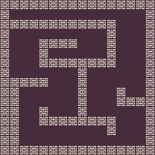
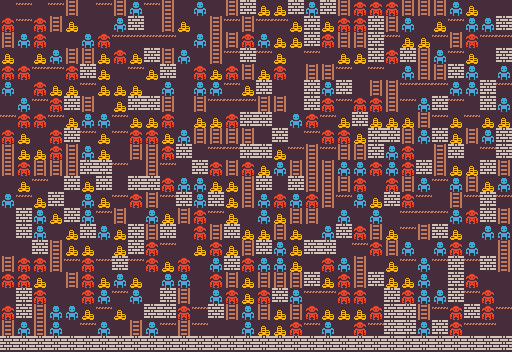
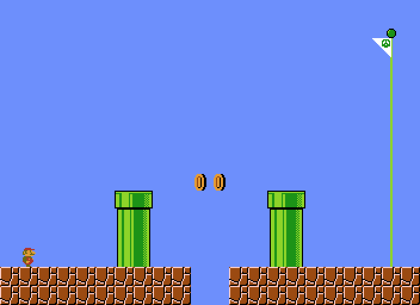

<p align="center">
  
</p>
<h1 align="center">
PCG Benchmark
</h1>
<p align="center">
  <b>Current Framework Version: 0.1.0</b>
</p>

PCG Benchmark is a framework to test and compare different content generators over different problems. The framework follows the same design methodology of [OpenAI Gym](https://github.com/openai/gym) which makes it easy to use, test, and expand for new problems.

This repo contains the framework that is used in our paper: [https://arxiv.org/abs/2503.21474](https://arxiv.org/abs/2503.21474). Please check the following repo for the experiments: [https://github.com/amidos2006/benchmark_experiments](https://github.com/amidos2006/benchmark_experiments). To cite the framework or the paper, use the following bibliography
```
@inproceedings{khalifa2025pcgbenchmark,
  title={The Procedural Content Generation Benchmark: An Open-source Testbed for Generative Challenges in Games},
  author={Khalifa, Ahmed and Gallota, Roberto and Barthet, Matthew and Liapis, Antonios and Togelius, Julian and Yannakakis, Georgios N.},
  booktitle={Foundations of Digital Games Conference},
  year={2025},
  publisher={ACM}
}
```

## Installation
There is two ways to install this repo, directly from github or by cloning locally then installing it

### Directly from Github
1. To install the package from github, run `pip install git+https://github.com/amidos2006/pcg_benchmark.git`. (Don't worry it will install all the dependencies automatically which are `numpy` and `PIL`).
2. If everything goes fine, the PCG Benchmark is ready to be used. Check the [following section](#usage) on how to use it.

### Locally Installing
1. Clone this repo to your local machine.
2. To install the package, run `pip install -e .` from inside the repo folder. (Don't worry it will install all the dependencies automatically which are `numpy` and `PIL`).
3. If everything goes fine, the PCG Benchmark is ready to be used. Check the [following section](#usage) on how to use it.


## Using the Framework
The PCG Benchmark follows the same design consideration of [OpenAI Gym](https://github.com/openai/gym) in its simplicity and ease of usage. The PCG Benchmark is just an interface for a multitude of problems. Each problem has its own representation, control parameters, and functions to test quality, diversity, and controllability. To learn more about the problems check [the following problems section](#problems). Each problem has a problem name that can be used to construct the environment. The problem name usually follows the following pattern.
```
{problem_name}-{variant_name}-{version}
```
where the default version is always `{problem_name}-{version}`. For example, the [Zelda problem](pcg_benchmark/probs/zelda/README.md) has the following name `zelda-v0`. It has two variants, one with lots of enemies called `zelda-enemie-v0` and one with a large map size called `zelda-large-v0`.

To construct a problem to solve, you need to import the framework `pcg_benchmark` and you can use the `make` function to create an environment. The `make` function takes the environment name and it returns a problem environment. For example, to create an environment for `zelda-v0` follow the following code:

```python
import pcg_benchmark

env = pcg_benchmark.make('zelda-v0')
```

The framework also provides two important functions `list` and `register`. The `list` function returns all the problems that exist in the framework. `register` on the other hand is used to register a new problem with the framework. For more details on how to create a new problem, look into [the problems readme.md](pcg_benchmark/probs#adding-new-problems).

The created problem environment provides multiple functions that can be used to test if content passes the `quality`, `diversity`, and `controlability` criteria. All of these function can be called directly from one function called `evaluate`. The `evaluate` function can take either one input (`contents` to evaluate) which in that case only returns `quality` and `diversity` or two inputs (`contents` to evaluate and `controls` to evaluate against for controllability) which in that case return all the metrics (`quality`, `diversity`, and `controlability`). The environment also provides a function to get details about content called `info` and spaces similar to [OpenAI Gym Spaces](https://gymnasium.farama.org/api/spaces/). There are two spaces `content_space` which defines the content search space (representation space of all the content) and `control_space` defines parameters that can be used to control the generated content and their possible values. You can use directly `sample` function from the space to sample random content and control parameters from the different spaces. You can also use `range` function from the space to find the minimum and maximum values for the contents and control parameters. Finally, you can render the content using `render` function. Here is an example of getting a random content 100 content and evaluating it then rendering it.

```python
import pcg_benchmark

# create a problem environment for the zelda problem
env = pcg_benchmark.make('zelda-v0')

# generate 100 random content from the content_space
contents = [env.content_space.sample() for _ in range(100)]

# geberate 100 random control parameters from the control_space
controls = [env.control_space.sample() for _ in range(100)]

# evaluate contents and controls from quality, diversity, controlability metrics
# quality is the percentage of the 100 levels that has passed the quality criteria
# diversity is the percentage of the 100 levels that are different from each other
# controlability is the percentage of the 100 levels that fits with the controls parameters
# details is a dictionary with "quality", "diversity", and "controlability" keys that have float array of 100 numbers between 0 and 1 which represents how close to solve the problem
# infos is an array of dictionaries that contain details about each content
quality, diversity, controlability, details, infos = env.evaluate(contents, controls)

# generate images for each content
imgs = env.render(contents)
```

If you want to test only one thing like `quality`, `diversity`, or `controlability`. You can use the corresponding function with the same name. These functions can take either 1 content, an array of content, 1 info dictionary, or an array of info dictionaries. `info` function is very useful as it generates all the useful information for the other functions. You can cache these values and use them instead of content so it doesn't need to do exhaustive calculations or simulations (It can be used for optimization). Finally, if you want to fix the random number generator used, please use `seed` function and provide a seed value to make sure that all the random number generators are set.

## Problems
The framework supports multitude of problems that can be found at [`pcg_benchmark.probs`](pcg_benchmark/probs). To understand more about each problem go to any of their folders and check the README files. Here a list of the current 12 problems:
| Name | Description | Problem Name | Example |
| ---- | ----------- | ------------ | ------- |
| [Arcade Rules](pcg_benchmark/probs/arcaderules/README.md) | create a small rule set for a simple arcade game | `arcade-v0` |  |
| [Binary](pcg_benchmark/probs/binary/README.md) | create a simple 2D fully connected maze | `binary-v0` |  |
| [Building](pcg_benchmark/probs/building/README.md) | create an isometric building of using different falling cubes | `building-v0` |  |
| [Dangerous Dave](pcg_benchmark/probs/ddave/README.md) | create a playable dangeroud dave level | `ddave-v0` |  |
| [Elimination](pcg_benchmark/probs/elimination/README.md) | create a playable elimination word game level | `elimination-v0` |  |
| [Isaac](pcg_benchmark/probs/isaac/README.md) | create a playable binding of isaac dungeon | `isaac-v0` |  |
| [Lode Runner](pcg_benchmark/probs/loderunner/README.md) | create a playable lode runner level using 2x2 tile patterns | `loderunner-v0` |  |
| [Lode Runner Tile](pcg_benchmark/probs/loderunnertile/README.md) | create a playable lode runner level using single tiles | `loderunnertile-v0` |  | 
| [MiniDungeons](pcg_benchmark/probs/mdungeons/README.md) | create a puzzle roguelike playable dungeon for mini dungeons | `mdungeons-v0` |  |
| [Super Mario Bros](pcg_benchmark/probs/smb/README.md) | create a playable super mario bros level using vertical slices | `smb-v0` |  |
| [Super Mario Bros Tile](pcg_benchmark/probs/smbtile/README.md) | create a playable super mario bros level using single tiles | `smbtile-v0` |  |
| [Sokoban](pcg_benchmark/probs/sokoban/README.md) | create a playable sokoban level | `sokoban-v0` |  |
| [Talakat](pcg_benchmark/probs/talakat/README.md) | create a bullet pattern for bullet hell games | `talakat-v0` |  |
| [Zelda](pcg_benchmark/probs/zelda/README.md) | create a simple playable arcade dungeon crawler game | `zelda-v0` |  |

To understand how to add new problems to the framework, please check the main [README.md](pcg_benchmark/probs/README.md) in the probs folder.

## Creating a Generator
You can check the example generators from our paper that you can find in the following repository [https://github.com/amidos2006/benchmark_experiments](https://github.com/amidos2006/benchmark_experiments) inside the [generators folder](https://github.com/amidos2006/benchmark_experiments/tree/main/generators). It contains 3 different generators that were tested in the paper `random` (Random Search), `es` (Mu + Lambda Evolution Strategy), and `ga` (Genetic Algorithm). To create any generator other than these, you usually need a way to navigate the search space. 

In optimization algorithms, this can be through crossover or mutation. The spaces class has a global function that could help with moving in the representation space called [`contentSwap`](pcg_benchmark/spaces/__init__.py#L51). The function takes two content and probability value to generate a new content that combines between both. If the probability is 50% then you have a uniform crossover function. For mutation or small change, the same function can be used for that. Make sure the second content is a new random content and the probability is low like 0.1 or 0.05. This will create a uniform mutation function. If you want to limit the number of swaps, you can set `maxSwaps` to any value above 0, and if you want to seed the random number generator, please set `seed` parameter to any value. Here is an example of both crossover function and mutation function.
```python
from pcg_benchmark.spaces import contentSwap

# uniform cross over
def uniform_crossover(prob_env, content1, content2):
  return contentSwap(content1, content2, 0.5)

# 5% uniform mutation by default
def uniform_mutation(prob_env, content, percentage=0.05):
  return contentSwap(content, prob_env.content_space.sample(), percentage)
```

The other needed function to create a generator besides sampling randomly, and discovering a neighboring content is to evaluate the content concerning `quality`, `diversity`, or `controlability`. We recommend for every content you generate the info data with it and use it instead of the content for all the calculations.
```python
def fitness(env, info):
  return env.quality(info)
```

Here is a full example of a simple mu+lambda ES algorithm with mu=lambda=50 to generate content for the `zelda-v0` problem for 100 generations.
```python
import pcg_benchmark
from pcg_benchmark.spaces import contentSwap

# uniform mutation
def uniform_mutation(prob_env, content, percentage=0.05):
  return contentSwap(content, prob_env.content_space.sample(), percentage)

# calculate the fitness based on individual (content, info)
def fitness(env, individual):
  return env.quality(individual[1])

# create the problem environment for zelda
env = pcg_benchmark.make("zelda-v0")
# create a random starting population of 50 individuals (content, info)
content = [env.content_space.sample() for _ in range(50)]
population = [(c, env.info(c)) for c in content]

# run for 100 generations
for _ in range(100):
  # create a new children from each indvidual in the population
  new_content = [uniform_mutation(prob_env, c) for c, _ in population]
  # create the new population of size mu+lambda (50+50)
  new_population = population + [(content, env.info(content)) for content in new_content]
  # kill the weakest 50 individuals
  new_population.sort(key=lambda c: fitness(env, c), reverse=True)
  population = new_population[:50]
  # stop if the best indvidual solve the problem
  if fitness(env, population[0]) >= 1:
    break
```

Finally, if you want to evolve content assuming the content is always a flat float array. the [`Space`](pcg_benchmark/spaces/space.py#L19) class have two helpful functions towards that. The [`sampleFlat`](pcg_benchmark/spaces/space.py#L85) and [`restructure`](pcg_benchmark/spaces/space.py#L76). The `sampleFlat` will return a float array that represents the content instead of the structured shape, while `restructure` takes a float array and make it back to the content shape and fix any wrong values in it.

## Special Thanks
Thanks to Kenny for creating [1-Bit Pack](https://kenney.nl/assets/1-bit-pack) which was used for most of the 12 problems in the benchmark. Even the ones that didn't use it were inspired by the color palette used in that pack.

## Contributing
Bug reports and pull requests are welcome on GitHub at [https://github.com/amidos2006/pcg_benchmark/](https://github.com/amidos2006/pcg_benchmark/).

## License
This code is available as open source under the terms of the [MIT License](https://opensource.org/licenses/MIT).
