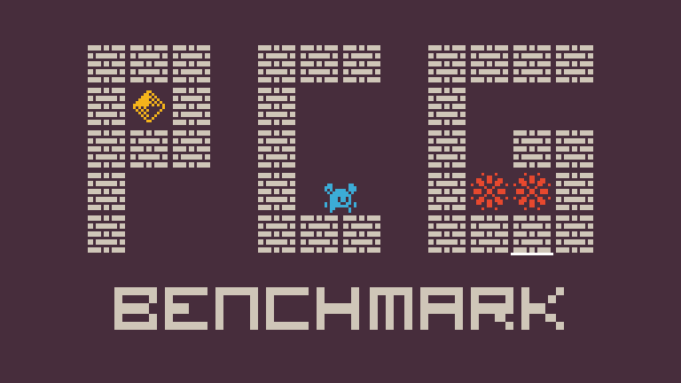

<p align="center">
  
</p>
<h1 align="center">
PCG Benchmark
</h1>
<p align="center">
  <b>Current Framework Version: 0.1.0</b>
</p>

## Installation
1. Clone this repo to your local machine.
2. To install the package, run `pip install -e .` from inside the repo folder. (Don't worry it will install all the depencies automatically which is `numpy` and `PIL`).
3. If everything went fine, the PCG Benchmark is ready to be used. Check the [following section](https://github.com/amidos2006/pcg_benchmark#usage) on how to use it.


## Usage
The PCG Benchmark follow the same design consideration of [OpenAI Gym](https://github.com/openai/gym) in its simplicty and easy of usage. The PCG Benchmark is just an interface for multitude of problems. Each problem has its own representation, control parameters, and functions to test quality, diversity, and controlability. To learn more about the problems check [the following problems section](https://github.com/amidos2006/pcg_benchmark#problems). Each problem has a problem name that can be used to construct the environment. The problem name usually following the following pattern.
```
{problem_name}-{variant_name}-{version}
```
where the default version is always `{problem_name}-{version}`. For example, the [Zelda problem](https://github.com/amidos2006/pcg_benchmark/blob/main/pcg_benchmark/probs/zelda/README.md) has the following name `zelda-v0`. It has two variants, one with lots of enemies called `zelda-enemie-v0` and one with large map size called `zelda-large-v0`.

To construct a problem to solve, you need to import the framework `pcg_benchmark` and you can use the `make` function to create an environment. The `make` function takes the environment name and it returns a problem environment. For example, to create an environment for `zelda-v0` follow the following code:

```python
import pcg_benchmark

pcg_env = pcg_benchmark.make('zelda-v0')
```

The framework also provide two important functions `list` and `register`. The `list` function return all the problems that exists in the framework. `register` on the other hand is used to register a new problem with the framework. For more details on how to create a new problem, look into [the problems readme.md](https://github.com/amidos2006/pcg_benchmark/tree/main/pcg_benchmark/probs#adding-new-problems).

The created problem environment provides multiple functions that can be used to test if a content passes the `quality`, `diversity`, and `controlability` criteria. All of these function can be called directly from one function called `evaluate`. The environment also provides function to get details about content called `info` and spaces similar to [OpenAI Gym Spaces](https://gymnasium.farama.org/api/spaces/). There is two spaces `_content_space` which defines the content search space (representation space of all the content) and `_control_space` defines parameters that can be used to control the generated content and their possible values. You can use directly `random_content` and `random_control` function to sample a random content and control parameter from the different spaces. You can also use `content_range` and `control_range` to find the minimum and maximum values for the contents and control parameters. Finally, you can render the content using `render` function. Here is an example of getting a random content 100 content and evaluating it then rendering it.

```python
import pcg_benchmark

# create a problem environment for the zelda problem
pcg_env = pcg_benchmark.make('zelda-v0')
# generate 100 random content from the _content_space
contents = pcg_env.random_content(100)
# geberate 100 random control parameters from the _control_space
controls = pcg_env.random_control(100)
# evaluate contents and controls from quality, diversity, controlability metrics
# quality is the percentage of the 100 levels that has passed the quality criteria
# diversity is the percentage of the 100 levels that are different from each other
# controlability is the percentage of the 100 levels that fits with the controls parameters
# details is a dictionary with "quality", "diversity", and "controlability" keys that have float array of 100 numbers between 0 and 1 which represents how close to solve the problem
# infos is an array of dictionaries that contain details about each content
quality, diversity, controlability, details, infos = pcg_env.evaluate(contents, controls)
# generate images for each content
imgs = pcg_env.renders(contents)
```

If you want to test only one thing like `quality`, `diversity`, or `controlability`. You can use the corresponding function with the same name. These function can take either 1 content, an array of content, 1 info dictionary, or an array of info dictionaries. `info` function is very useful as it generate all the useful information for the other functions. You can cache these values and use them instead of content so it doesn't need to do exhaustive calculations or simulations (It can be used for optimization).

## Problems
The framework supports multitude of problems that can be found at [https://github.com/amidos2006/pcg_benchmark/tree/main/pcg_benchmark/probs](https://github.com/amidos2006/pcg_benchmark/tree/main/pcg_benchmark/probs). To understand more about each problem go to any of their folders and check the README files. Here a list of the current 12 problems:
| Name | Description | Problem Name |
| ---- | ----------- | ----------- |
| [Arcade Rules](https://github.com/amidos2006/pcg_benchmark/blob/main/pcg_benchmark/probs/arcaderules/README.md) | create a small rule set for a simple arcade game | `arcade-v0` |
| [Binary](https://github.com/amidos2006/pcg_benchmark/blob/main/pcg_benchmark/probs/binary/README.md) | create a simple 2D fully connected maze | `binary-v0` |
| [Building](https://github.com/amidos2006/pcg_benchmark/blob/main/pcg_benchmark/probs/building/README.md) | create an isometric building of using different falling cubes | `building-v0` |
| [Dangerous Dave](https://github.com/amidos2006/pcg_benchmark/blob/main/pcg_benchmark/probs/ddave/README.md) | create a playable dangeroud dave level | `ddave-v0` |
| [Elimination](https://github.com/amidos2006/pcg_benchmark/blob/main/pcg_benchmark/probs/elimination/README.md) | create a playable elimination word game level | `elimination-v0` |
| [The Binding of Isaac](https://github.com/amidos2006/pcg_benchmark/blob/main/pcg_benchmark/probs/isaac/README.md) | create a playable binding of isaac dungeon | `isaac-v0` |
| [Lode Runner](https://github.com/amidos2006/pcg_benchmark/blob/main/pcg_benchmark/probs/loderunner/README.md) | create a playable lode runner level | `loderunner-v0` |
| [MiniDungeons](https://github.com/amidos2006/pcg_benchmark/blob/main/pcg_benchmark/probs/mdungeon/README.md) | create a puzzle roguelike playable dungeon for mini dungeons | `mdungeon-v0` |
| [Super Mario Bros](https://github.com/amidos2006/pcg_benchmark/blob/main/pcg_benchmark/probs/smb/README.md) | create a playable super mario bros level using vertical slices | `smb-v0` |
| [Sokoban](https://github.com/amidos2006/pcg_benchmark/blob/main/pcg_benchmark/probs/sokoban/README.md) | create a playable sokoban level | `sokoban-v0` |
| [Talakat](https://github.com/amidos2006/pcg_benchmark/blob/main/pcg_benchmark/probs/talakat/README.md) | create a bullet pattern for bullet hell games | `talakat-v0` |
| [Zelda](https://github.com/amidos2006/pcg_benchmark/blob/main/pcg_benchmark/probs/zelda/README.md) | create a simple playable arcade dungeon crawler game | `zelda-v0` |

To understand how to add new problems to the framework, please check the main [README.md](https://github.com/amidos2006/pcg_benchmark/blob/main/pcg_benchmark/probs/README.md) at the probs folder.

## Running Generators


## Contributing
Bug reports and pull requests are welcome on GitHub at [https://github.com/amidos2006/pcg_benchmark/](https://github.com/amidos2006/pcg_benchmark/).

## License
This code is available as open source under the terms of the [MIT License](https://opensource.org/licenses/MIT).