<p align="center">
  
</p>
<h1 align="center">
PCG Benchmark
</h1>
<p align="center">
  <b>Current Framework Version: 0.1.0</b>
</p>

PCG Benchmark is a framework to test and compare different content generators over different problems. The framework follows the same design methodology of [OpenAI Gym](https://github.com/openai/gym) which makes it easy to use, test, and expand for new problems.

This repo contains the framework and some initial generators that are provided with the paper. To cite the framework or the paper use the following bibliography
```
@inproceedings{khalifa20XXpcgbenchmark,
  title={PCG Benchamrk},
  author={Khalifa, Ahmed .....}
}
```

## Installation
1. Clone this repo to your local machine.
2. To install the package, run `pip install -e .` from inside the repo folder. (Don't worry it will install all the dependencies automatically which are `numpy` and `PIL`).
3. If everything goes fine, the PCG Benchmark is ready to be used. Check the [following section](#usage) on how to use it.


## Using the Framework
The PCG Benchmark follows the same design consideration of [OpenAI Gym](https://github.com/openai/gym) in its simplicity and ease of usage. The PCG Benchmark is just an interface for a multitude of problems. Each problem has its own representation, control parameters, and functions to test quality, diversity, and controllability. To learn more about the problems check [the following problems section](#problems). Each problem has a problem name that can be used to construct the environment. The problem name usually follows the following pattern.
```
{problem_name}-{variant_name}-{version}
```
where the default version is always `{problem_name}-{version}`. For example, the [Zelda problem](pcg_benchmark/probs/zelda/README.md) has the following name `zelda-v0`. It has two variants, one with lots of enemies called `zelda-enemie-v0` and one with a large map size called `zelda-large-v0`.

To construct a problem to solve, you need to import the framework `pcg_benchmark` and you can use the `make` function to create an environment. The `make` function takes the environment name and it returns a problem environment. For example, to create an environment for `zelda-v0` follow the following code:

```python
import pcg_benchmark

env = pcg_benchmark.make('zelda-v0')
```

The framework also provides two important functions `list` and `register`. The `list` function returns all the problems that exist in the framework. `register` on the other hand is used to register a new problem with the framework. For more details on how to create a new problem, look into [the problems readme.md](pcg_benchmark/probs#adding-new-problems).

The created problem environment provides multiple functions that can be used to test if content passes the `quality`, `diversity`, and `controlability` criteria. All of these function can be called directly from one function called `evaluate`. The `evaluate` function can take either one input (`contents` to evaluate) which in that case only returns `quality` and `diversity` or two inputs (`contents` to evaluate and `controls` to evaluate against for controllability) which in that case return all the metrics (`quality`, `diversity`, and `controlability`). The environment also provides a function to get details about content called `info` and spaces similar to [OpenAI Gym Spaces](https://gymnasium.farama.org/api/spaces/). There are two spaces `content_space` which defines the content search space (representation space of all the content) and `control_space` defines parameters that can be used to control the generated content and their possible values. You can use directly `sample` function from the space to sample random content and control parameters from the different spaces. You can also use `range` function from the space to find the minimum and maximum values for the contents and control parameters. Finally, you can render the content using `render` function. Here is an example of getting a random content 100 content and evaluating it then rendering it.

```python
import pcg_benchmark

# create a problem environment for the zelda problem
env = pcg_benchmark.make('zelda-v0')

# generate 100 random content from the content_space
contents = [env.content_space.sample() for _ in range(100)]

# geberate 100 random control parameters from the control_space
controls = [env.control_space.sample() for _ in range(100)]

# evaluate contents and controls from quality, diversity, controlability metrics
# quality is the percentage of the 100 levels that has passed the quality criteria
# diversity is the percentage of the 100 levels that are different from each other
# controlability is the percentage of the 100 levels that fits with the controls parameters
# details is a dictionary with "quality", "diversity", and "controlability" keys that have float array of 100 numbers between 0 and 1 which represents how close to solve the problem
# infos is an array of dictionaries that contain details about each content
quality, diversity, controlability, details, infos = env.evaluate(contents, controls)

# generate images for each content
imgs = env.render(contents)
```

If you want to test only one thing like `quality`, `diversity`, or `controlability`. You can use the corresponding function with the same name. These functions can take either 1 content, an array of content, 1 info dictionary, or an array of info dictionaries. `info` function is very useful as it generates all the useful information for the other functions. You can cache these values and use them instead of content so it doesn't need to do exhaustive calculations or simulations (It can be used for optimization). Finally, if you want to fix the random number generator used, please use `seed` function and provide a seed value to make sure that all the random number generators are set.

## Problems
The framework supports multitude of problems that can be found at [`pcg_benchmark.probs`](pcg_benchmark/probs). To understand more about each problem go to any of their folders and check the README files. Here a list of the current 12 problems:
| Name | Description | Problem Name |
| ---- | ----------- | ----------- |
| [Arcade Rules](pcg_benchmark/probs/arcaderules/README.md) | create a small rule set for a simple arcade game | `arcade-v0` |
| [Binary](pcg_benchmark/probs/binary/README.md) | create a simple 2D fully connected maze | `binary-v0` |
| [Building](pcg_benchmark/probs/building/README.md) | create an isometric building of using different falling cubes | `building-v0` |
| [Dangerous Dave](pcg_benchmark/probs/ddave/README.md) | create a playable dangeroud dave level | `ddave-v0` |
| [Elimination](pcg_benchmark/probs/elimination/README.md) | create a playable elimination word game level | `elimination-v0` |
| [Isaac](pcg_benchmark/probs/isaac/README.md) | create a playable binding of isaac dungeon | `isaac-v0` |
| [Lode Runner](pcg_benchmark/probs/loderunner/README.md) | create a playable lode runner level | `loderunner-v0` |
| [MiniDungeons](pcg_benchmark/probs/mdungeons/README.md) | create a puzzle roguelike playable dungeon for mini dungeons | `mdungeons-v0` |
| [Super Mario Bros](pcg_benchmark/probs/smb/README.md) | create a playable super mario bros level using vertical slices | `smb-v0` |
| [Sokoban](pcg_benchmark/probs/sokoban/README.md) | create a playable sokoban level | `sokoban-v0` |
| [Talakat](pcg_benchmark/probs/talakat/README.md) | create a bullet pattern for bullet hell games | `talakat-v0` |
| [Zelda](pcg_benchmark/probs/zelda/README.md) | create a simple playable arcade dungeon crawler game | `zelda-v0` |

To understand how to add new problems to the framework, please check the main [README.md](pcg_benchmark/probs/README.md) in the probs folder.

## Creating a Generator
You can check the example generators in the [generators folder](generators/) at the root of the project. It contains 3 different generators that were tested in the paper `random` (Random Search), `es` (Mu + Lambda Evolution Strategy), and `ga` (Genetic Algorithm). To create any generator other than these, you usually need a way to navigate the search space. 

In optimization algorithms, this can be through crossover or mutation. The spaces class has a global function that could help with moving in the representation space called [`contentSwap`](pcg_benchmark/spaces/__init__.py#L51). The function takes two content and probability value to generate a new content that combines between both. If the probability is 50% then you have a uniform crossover function. For mutation or small change, the same function can be used for that. Make sure the second content is a new random content and the probability is low like 0.1 or 0.05. This will create a uniform mutation function. If you want to limit the number of swaps, you can set `maxSwaps` to any value above 0, and if you want to seed the random number generator, please set `seed` parameter to any value. Here is an example of both crossover function and mutation function.
```python
from pcg_benchmark.spaces import contentSwap

# uniform cross over
def uniform_crossover(prob_env, content1, content2):
  return contentSwap(content1, content2, 0.5)

# 5% uniform mutation by default
def uniform_mutation(prob_env, content, percentage=0.05):
  return contentSwap(content, prob_env.content_space.sample(), percentage)
```

The other needed function to create a generator besides sampling randomly, and discovering a neighboring content is to evaluate the content concerning `quality`, `diversity`, or `controlability`. We recommend for every content you generate the info data with it and use it instead of the content for all the calculations.
```python
def fitness(env, info):
  return env.quality(info)
```

Here is a full example of a simple mu+lambda ES algorithm with mu=lambda=50 to generate content for the `zelda-v0` problem for 100 generations.
```python
import pcg_benchmark
from pcg_benchmark.spaces import contentSwap

# uniform mutation
def uniform_mutation(prob_env, content, percentage=0.05):
  return contentSwap(content, prob_env.content_space.sample(), percentage)

# calculate the fitness based on individual (content, info)
def fitness(env, individual):
  return env.quality(individual[1])

# create the problem environment for zelda
env = pcg_benchmark.make("zelda-v0")
# create a random starting population of 50 individuals (content, info)
content = [env.content_space.sample() for _ in range(50)]
population = [(c, env.info(c)) for c in content]

# run for 100 generations
for _ in range(100):
  # create a new children from each indvidual in the population
  new_content = [uniform_mutation(prob_env, c) for c, _ in population]
  # create the new population of size mu+lambda (50+50)
  new_population = population + [(content, env.info(content)) for content in new_content]
  # kill the weakest 50 individuals
  new_population.sort(key=lambda c: fitness(env, c), reverse=True)
  population = new_population[:50]
  # stop if the best indvidual solve the problem
  if fitness(env, population[0]) >= 1:
    break
```

Finally, if you want to evolve content assuming the content is always a flat float array. the [`Space`](pcg_benchmark/spaces/space.py#L19) class have two helpful functions towards that. The [`sampleFlat`](pcg_benchmark/spaces/space.py#L85) and [`restructure`](pcg_benchmark/spaces/space.py#L76). The `sampleFlat` will return a float array that represents the content instead of the structured shape, while `restructure` takes a float array and make it back to the content shape and fix any wrong values in it.

## Using The Generator Runner
This section talks about using [`run.py`](run.py) to run one of the generators in the [`generators`](generators/) folder. The `run.py` is designed to run interactive generators and save the data between these iterations. The script takes a couple of parameters and then runs the generator and saves all the details of the run in folders on your hard drive. The parameters are:
- `outputfolder`: This is the only **mandatory** input for the script. It specifies the folder that the outputs should be saved inside.
- `--problem`|`-p`: The problem name that you want to run the generator against. Look at all the problem names in [Problems section](#problems) for that. The default value for this parameter is `binary-v0`
- `--generator`|`-g`: The file name where the generator is saved in. Right now there are three files for three different generators. [`random`](generators/random.py) contains a Random Search algorithm, [`es`](generators/es.py) contains a Mu + Lambda evolution Strategy, and [`ga`](generators/ga.py) contains a Genetic algorithm. The default value for this parameter is `random`.
- `--steps`|`-s`: The number of iterations to run the generator [`update`](generators/search.py#L25) function for.
- `--earlystop`|`-e`: If this exists in the command line, the generator will stop as soon as the best solution is the maximum which is 1.0.

If you wanna set some of the algorithm hyperparameters for the available algorithm such as the fitness function used in the search process. You can in the command line the parameter name in the form of `fitness` or `--fitness` and then follow by the allowed values. For the fitness function, we have 3 different ones: 
- [`quality`|`fitness_quality`](generators/utils.py#L111) computes the quality metric for the content and returns it as fitness. 
- [`quality_control`|`fitness_quality_control`](generators/utils.py#L114) computes the quality metric then control if you passed the quality as cascaded fitness. 
- [`quality_control_diversity`|`fitness_quality_control_diversity`](generators/utils.py#L120) computes the quality then controllability then diversity in cascaded manner as fitness, this fitness is not stable because diversity depends on the population and how diverse it is so the value of a chromosome from before that passes diversity might not pass it now.

Every parameter has a default value for example the fitness default is `quality`.

Here is an example of running a Genetic Algorithm to try to solve [`sokoban-v0`](pcg_benchmark/probs/sokoban) problem with a fitness that cares about quality and controllability and number of generations/iterations of 1000. If at any time the algorithm finds a solution, it will stop before reaching 1000 iterations.
```bash
python run.py outputs -p sokoban-v0 -g ga -s 1000 -e --fitness quality_control
```

Finally, before you start, look in the reset function for every generator to know the names of its hyperparameters if you want to tune them to a specific value. For example, `ga` has `pop_size`|`--pop_size` parameter to set the size of the population of the genetic algorithm.

## Adding a new Generator to `run.py`
This section will talk about how to integrate your generator to work with `run.py` (the generator runner). To add your new generator such that you can just use `run.py`, you need to make sure that your generator implements the `generators.utils.Generator` class. This involves making sure the constructor only needs one input `env`. Besides the constructor, you need to implement the following functions:
- `reset(self, **kwargs)`: this function initializes your generator to do a new run at any moment. Each algorithm also has hyperparameters that are being set here using kwargs. For example, all the algorithms have `seed` to seed the random number generator.
- `update(self)`: this function updates the current state of the generator to generate the next state. In evolution, it is the next generation. In cellular automata/NCA, it is the next update from its current state. In PCGRL, it is the next update of the map from its current state. In GANs, it could just produce a new one and that is it.
- `best(self)`: this function returns the evaluation of the solution so far where the value should be bounded between 0 and 1 where 1 means it solved the problem.
- `save(self, foldername)`: saves the state of the generator in a specific folder (`foldername`) so you can analyze the results and load it to continue later.
- `load(self, foldername)`: loads the state of the generator from the specific folder (`foldername`) so you can continue the update or generation later.

You can always have access to the parent class variables:
- `self._env`: access to the problem environment so you can call functions to evaluate the content
- `self._random`: a `numpy` random variable that can be used to sample random stuff.

One last note, if you decide to build a search algorithm you can build on top of `generators.search.Generator` which is the base class of all the search base ones. It has a definition for `Chromosome` class and the `Generator` base class has access to `self._chromosomes` and `self._fitness_fn` for the fitness function. The fitness function is set from the ones in the same file. These are the ones that are defined: 
- `quality(self)`: return a value between 0 and 1 where 1 means it has solved the problem from quality perspective
- `controlability(self)`: return a value between 0 and 1 where 1 means it has solved the problem from a controllability perspective. In our generators, we assign a control parameter to each chromosome to evaluate.
- `diversity(self)`: return a value between 0 and 1 where 1 means it is very different from all the other chromosomes that are surrounding it. In our generators, we calculate the diversity between all the individuals in the population during evolution.

If you want to have your new fitness function just add it in the same module `generators.search` and the system will access it using the name when provided in the command line.

## Examples of Generated Content
These are some examples of the generated content for every environment in the framework, for the optimization algorithm more details can be found about them in the paper or by checking [`generators.es`](generators/es.py) and [`generators.ga`](generators/ga.py). Random here is just sampling randomly from the space. If you need to check more examples please check the [images](images/) folder.

| Name | Random | Evolution Strategy | Genetic Algorithm |
| ---- | ------ | ------------------ | ----------------- |
| `arcade-v0` |  | 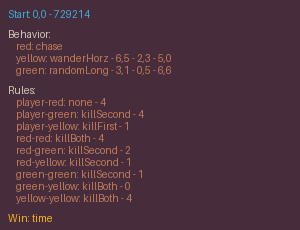 | 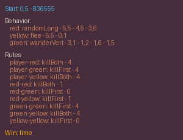 |
| `binary-v0` | 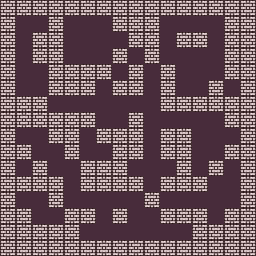 | 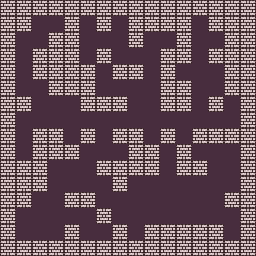 | 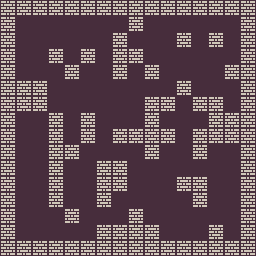 |
| `building-v0` |  |  |  |
| `ddave-v0` | 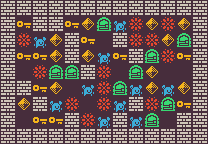 | 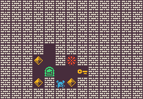 | 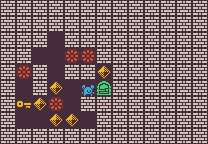 |
| `elimination-v0` |  |  |  |
| `isaac-v0` | 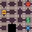 |  | 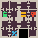 |
| `loderunner-v0` | 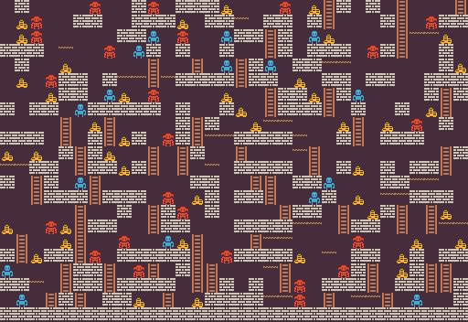 | 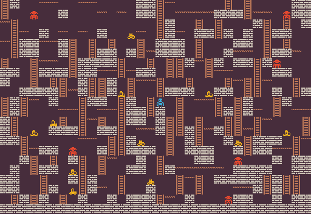 | 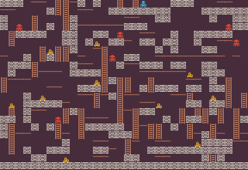 |
| `mdungeons-v0` | 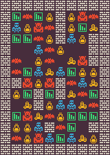 | 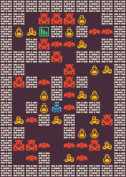 | 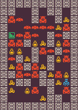 |
| `smb-v0` | 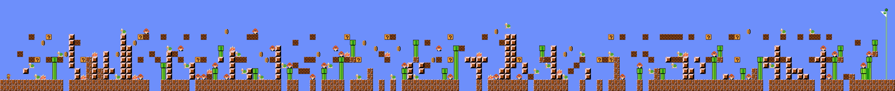 | 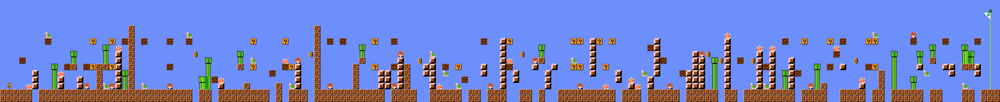 | 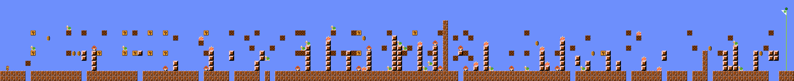 |
| `sokoban-v0` | 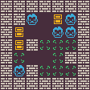 | 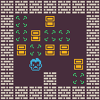 | 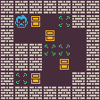 |
| `talakat-v0` |  |  |  |
| `zelda-v0` | 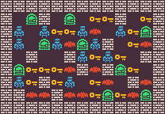 | 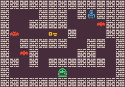 | 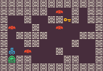 |

## Processing results
You can quickly run and then evaluate your results, plotting the relevant graphs using `run_experiments.bat` and `data_processing.py`, provided in this repo but not included in the library itself.
These are ready-made scripts, but you can run the experiments in any other way you want. Once experiments are over, you can process the results via
```bash
python data_processing.py run_pipeline --root_dir="./results" --output_dir='./plots'
```
You can also just execute single steps of the pipeline (`process_environment`, `process_all_envs`, `aggregate_envs_statistics`, `aggregate_over_runs`, and `plot`) by changing `run_pipeline` with the corresponding function (and using the corresponding parameters).

## Special Thanks
Thanks to Kenny for creating [1-Bit Pack](https://kenney.nl/assets/1-bit-pack) which was used for most of the 12 problems in the benchmark. Even the ones that didn't use it were inspired by the color palette used in that pack.

## Contributing
Bug reports and pull requests are welcome on GitHub at [https://github.com/amidos2006/pcg_benchmark/](https://github.com/amidos2006/pcg_benchmark/).

## License
This code is available as open source under the terms of the [MIT License](https://opensource.org/licenses/MIT).
