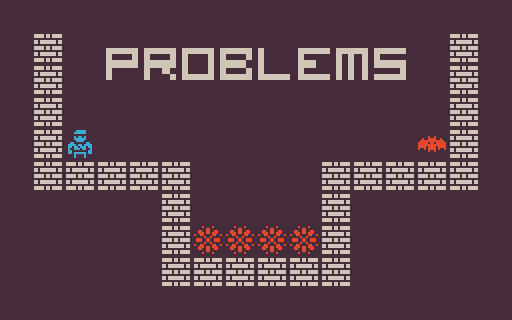

<p align="center">
  
</p>
<h1 align="center">
PCG Benchmark Problems
</h1>

Problems are the main class for the framework, they contains the actual functions and spaces that the [PCGEnv class](https://github.com/amidos2006/pcg_benchmark/blob/main/pcg_benchmark/pcg_env.py) calls and uses. Every problem has the following:
- [`_content_space`](https://github.com/amidos2006/pcg_benchmark/blob/main/pcg_benchmark/probs/problem.py#L16): the content space where you can sample any content from the representation space
- [`_control_space`](https://github.com/amidos2006/pcg_benchmark/blob/main/pcg_benchmark/probs/problem.py#L17): the control space where you can sample any control parameter from the control paramter space
- [`info(content)`](https://github.com/amidos2006/pcg_benchmark/blob/main/pcg_benchmark/probs/problem.py#L32): do all the simulation and the calculation and return an object that contains all the information
- [`quality(info)`](https://github.com/amidos2006/pcg_benchmark/blob/main/pcg_benchmark/probs/problem.py#L49): takes an info object a return a number between 0 and 1 where 1 means it solved the problem
- [`diversity(info1,info2)`](https://github.com/amidos2006/pcg_benchmark/blob/main/pcg_benchmark/probs/problem.py#L66): takes two info objects from two content and return a value between 0 and 1 where 1 means these two content are different from each other
- [`controlability(info, control)`](https://github.com/amidos2006/pcg_benchmark/blob/main/pcg_benchmark/probs/problem.py#L84): takes an info object and a control parameter and return a value between 0 and 1 where 1 means that this content follow the control parameter correctly
- [`render(content)`](https://github.com/amidos2006/pcg_benchmark/blob/main/pcg_benchmark/probs/problem.py#L96): renders the content into an a `PIL.Image`

## List of All Problems
This is a list of all the supported problems and variants in the framework, you can either use the problem name for the default version or one of the variant names if you want a different challenge. if you want to test against only the main versions only, you can [`list()`](https://github.com/amidos2006/pcg_benchmark/blob/main/pcg_benchmark/__init__.py#L28) all the problems from `pcg_benchmark` and filter by having one `-` for the main problem and two `-` for variants.

```python
import pcg_benchmark

normal = [name for name in pcg_benchmark.list() if len(name.split('-')) == 2]
variants = [name for name in pcg_benchmark.list() if len(name.split('-')) > 2]
```

| Name | Description | Problem Name | Variant Names |
| ---- | ----------- | ------------ | ------------- |
| [Arcade Rules](https://github.com/amidos2006/pcg_benchmark/blob/main/pcg_benchmark/probs/arcaderules/README.md) | create a small rule set for a simple arcade game | `arcade-v0` | `arcade-wide-v0`, `arcade-large-v0` |
| [Binary](https://github.com/amidos2006/pcg_benchmark/blob/main/pcg_benchmark/probs/binary/README.md) | create a simple 2D fully connected maze | `binary-v0` | `binary-wide-v0`, `binary-large-v0` |
| [Building](https://github.com/amidos2006/pcg_benchmark/blob/main/pcg_benchmark/probs/building/README.md) | create an isometric building of using different falling cubes | `building-v0` | `building-large-v0`, `building-tall-v0`, `building-huge-v0` |
| [Dangerous Dave](https://github.com/amidos2006/pcg_benchmark/blob/main/pcg_benchmark/probs/ddave/README.md) | create a playable dangeroud dave level | `ddave-v0` | `ddave-complex-v0`, `ddave-large-v0` |
| [Elimination](https://github.com/amidos2006/pcg_benchmark/blob/main/pcg_benchmark/probs/elimination/README.md) | create a playable elimination word game level | `elimination-v0` | `elimination-easy-v0`, `elimination-hard-v0` |
| [Isaac](https://github.com/amidos2006/pcg_benchmark/blob/main/pcg_benchmark/probs/isaac/README.md) | create a playable binding of isaac dungeon | `isaac-v0` | `isaac-medium-v0`, `isaac-large-v0` |
| [Lode Runner](https://github.com/amidos2006/pcg_benchmark/blob/main/pcg_benchmark/probs/loderunner/README.md) | create a playable lode runner level using 2x2 tile patterns | `loderunner-v0` | `loderunner-gold-v0`, `loderunner-enemies-v0` |
| [Lode Runner Tile](https://github.com/amidos2006/pcg_benchmark/blob/main/pcg_benchmark/probs/loderunner/README.md) | create a playable lode runner level using single tiles | `loderunnertile-v0` | `loderunnertile-gold-v0`, `loderunnertile-enemies-v0` |
| [MiniDungeons](https://github.com/amidos2006/pcg_benchmark/blob/main/pcg_benchmark/probs/mdungeons/README.md) | create a puzzle roguelike playable dungeon for mini dungeons | `mdungeon-v0` | `mdungeons-enemies-v0`, `mdungeons-large-v0` |
| [Super Mario Bros](https://github.com/amidos2006/pcg_benchmark/blob/main/pcg_benchmark/probs/smb/README.md) | create a playable super mario bros level using vertical slices | `smb-v0` | `smb-scene-v0`, `smb-small-v0`, `smb-medium-v0` |
| [Super Mario Bros Tile](https://github.com/amidos2006/pcg_benchmark/blob/main/pcg_benchmark/probs/smbtile/README.md) | create a playable super mario bros level using single tiles | `smbtile-v0` | `smbtile-scene-v0`, `smbtile-small-v0`, `smbtile-medium-v0` |
| [Sokoban](https://github.com/amidos2006/pcg_benchmark/blob/main/pcg_benchmark/probs/sokoban/README.md) | create a playable sokoban level | `sokoban-v0` | `sokoban-complex-v0`, `sokoban-large-v0` |
| [Talakat](https://github.com/amidos2006/pcg_benchmark/blob/main/pcg_benchmark/probs/talakat/README.md) | create a bullet pattern for bullet hell games | `talakat-v0` | `talakat-small-v0`, `talakat-long-v0` |
| [Zelda](https://github.com/amidos2006/pcg_benchmark/blob/main/pcg_benchmark/probs/zelda/README.md) | create a simple playable arcade dungeon crawler game | `zelda-v0` | `zelda-enemies-v0`, `zelda-large-v0` |

## Creating and Registering New Problems
The first step to create new problem is to create a class that inherit from the base [`Problem`](https://github.com/amidos2006/pcg_benchmark/blob/main/pcg_benchmark/probs/problem.py) class from `pcg_benchmark.probs`. The new class should implement the main functions that was explained at the beginning of the document. Here are there repeated again:
- [`info(content)`](https://github.com/amidos2006/pcg_benchmark/blob/main/pcg_benchmark/probs/problem.py#L32): do all the simulation and the calculation and return an object that contains all the information
- [`quality(info)`](https://github.com/amidos2006/pcg_benchmark/blob/main/pcg_benchmark/probs/problem.py#L49): takes an info object a return a number between 0 and 1 where 1 means it solved the problem
- [`diversity(info1,info2)`](https://github.com/amidos2006/pcg_benchmark/blob/main/pcg_benchmark/probs/problem.py#L66): takes two info objects from two content and return a value between 0 and 1 where 1 means these two content are different from each other
- [`controlability(info, control)`](https://github.com/amidos2006/pcg_benchmark/blob/main/pcg_benchmark/probs/problem.py#L84): takes an info object and a control parameter and return a value between 0 and 1 where 1 means that this content follow the control parameter correctly
- [`render(content)`](https://github.com/amidos2006/pcg_benchmark/blob/main/pcg_benchmark/probs/problem.py#L96): renders the content into an a `PIL.Image`

The constructor of the class should take `**kwargs` where it can be any of the parameters for the problem needed. The constructor also should initialize the following two attributes using the [`pcg_benchmark.spaces`](https://github.com/amidos2006/pcg_benchmark/tree/main/pcg_benchmark/spaces):
- [`_content_space`](https://github.com/amidos2006/pcg_benchmark/blob/main/pcg_benchmark/probs/problem.py#L16): the content space where you can sample any content from the representation space
- [`_control_space`](https://github.com/amidos2006/pcg_benchmark/blob/main/pcg_benchmark/probs/problem.py#L17): the control space where you can sample any control parameter from the control paramter space

Spaces are classes to create ranges where you can sample randomly from similar to [Spaces](https://www.gymlibrary.dev/api/spaces/) from [OpenAI Gym](https://github.com/openai/gym). They can be used to create a space of all the possible content or control parameters. There is two type of basic spaces:
- [`IntegerSpace`](https://github.com/amidos2006/pcg_benchmark/blob/main/pcg_benchmark/spaces/integer.py): a space for integer numbers in a specific range
- [`FloatSpace`](https://github.com/amidos2006/pcg_benchmark/blob/main/pcg_benchmark/spaces/float.py): a space for float numbers in a specific range

A more complicated space might be used to have more complex search space. Here are the three complex spaces: 
- [`ArraySpace`](https://github.com/amidos2006/pcg_benchmark/blob/main/pcg_benchmark/spaces/array.py): a space of any shape array with a space as the base value.
- [`DictionarySpace`](https://github.com/amidos2006/pcg_benchmark/blob/main/pcg_benchmark/spaces/dictionary.py): a space that has keys and values where values can be anything, if it is a space then it can be sampled recursively.
- [`GenericSpace`](https://github.com/amidos2006/pcg_benchmark/blob/main/pcg_benchmark/spaces/generic.py): a space of any thing. [`ArraySpace`](https://github.com/amidos2006/pcg_benchmark/blob/main/pcg_benchmark/spaces/array.py) and [`DictionarySpace`](https://github.com/amidos2006/pcg_benchmark/blob/main/pcg_benchmark/spaces/dictionary.py) are special case of this space. This class can sample if there is base classes inside or keep the same structure of everything else.

After creating the problem class, there is two ways to register it, the easiest way is to register it using `register` function provided by the framework. The function takes a name, the class, and any parameters needed to initialize the class. For example, here an example of registering a new problem called all ones. This problem is about generating 1D dimension array of 1s and 0s and the quality is to have at least 75% of numbers are 1, while diversity is difference between number of 1s should be at least 10%. Finally, controlability is how many ones are there in the string with minimum equal to 75% of the length.

```python
import pcg_benchmark
import numpy as np
from pcg_benchmark.spaces import DictionarySpace, ArraySpace, IntegerSpace
from pcg_benchmark.probs import Problem

"""
All Ones problem where you try to generate 1d array of zeros and ones
"""
class AllOnes(Problem):
    """
    The constructor for all ones problems
    
    Parameters:
        length(int): the length of the array that you want to generate
    """
    def __init__(self, **kwargs):
        self._length = kwargs.get('length')
        self._target = int(0.75 * self._length)
        self._difference = int(0.1 * self._length)

        self._content_space = ArraySpace((self._length), IntegerSpace(2))
        self._control_space = DictionarySpace({"ones": IntegerSpace(self._target, self._length)})

    """
    The info function that returns the information of the content that is used
    in all the evaluation functions.

    Parameters:
        content(int[]): the content that you want to get its information

    Returns:
        dict: a dictionary of the information of the content (number of ones in the content)
    """
    def info(self, content):
        return {"ones": np.sum(content) }

    """
    The quality function that returns the quality of the content based on the
    information of the content.
    
    Parameters:
        info(dict): the information dictionary about the content need to be evaluated.

    Returns:
        float: the quality of the content based on the information where 1 means perfect 
        (more than 75% of the content is ones).
    """
    def quality(self, info):
        if info["ones"] > self._target:
            return 1.0
        return (self._target - info["ones"]) / self._target

    """
    The diversity function that returns the diversity between two contents based on their information.
    
    Parameters:
        info1(dict): the information dictionary about the first content
        info2(dict): the information dictionary about the second content

    Returns:
        float: the diversity between the two contents based on their information 
        where 1 means completely different (more than 10% of the number of ones are different) 
        and 0 means completely similar.
    """
    def diversity(self, info1, info2):
        diff = abs(info1["ones"] - info2["ones"])
        if diff > self._difference:
            return 1.0
        return (self._difference - diff) / self._difference
  
    """
    The controlability function that returns the controllability of the content 
    based on the information and the control parameter

    Parameters:
        info(dict): the information dictionary about the content
        control(dict): the control dictionary that you need to target

    Returns:
        float: the controllability of the content based on the information and control 
        where 1 means completely controllable (the number of ones is equal to the target) 
        and 0 means not controllable.
    """
    def controlability(self, info, control):
        return (self._length - abs(info["ones"] - control["ones"])) / self._length

    """
    The render function that returns the content in a string format.

    Returns:
        string: the content in a string format.
    """
    def render(self, content):
        return str(content)

# Register the problem in the pcg_benchmark
# The name of the problem is allones-v0 following the naming scheme {name}-{version}
pcg_benchmark.register('allones-v0', AllOnes, {"length": 100})
# Register a variation of the problem with a different length
# The name of the problem is allones-long-v1 following the naming scheme {name}-{modification}-{version}
pcg_benchmark.register('allones-long-v1', AllOnes, {"length": 1000})

# Example of how to use the problem using the registered name
env = pcg_benchmark.make('allones-v0')
```