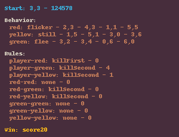

<p align="center">
	
</p>
<h1 align="center">
Arcade Rules Problem
</h1>

Arcade Rules Problem based on the simple framework introduced by Togelius in 2008 in ["An Experiment in Automatic Game Design"](http://julian.togelius.com/Togelius2008An.pdf). The goal is to generate new games and test them on a fixed layout or the one provided by the control parameter.

The problem has 3 variants:
- `arcade-v0`: generate a group of rules and test them on a 7x7 level excluding the borders
- `arcade-wide-v0`: generate a group of rules and test them on 15x7 level excluding the borders
- `arcade-large-v0`: generate a group of rules and test them on 15x15 level excluding the borders

## Content Structure
The content is a dictionary that has all the information about the current evolved game. Here is an example of the content that can be evaluated by the system:
```python
{
    "seed": 124578,
    "x": 3,
    "y": 3,
    "red": 1,
    "yellow": 0,
    "green": 7,
    "redStart": {
        "num": 4,
        "x": [2, 4, 1, 5],
        "y": [3, 3, 1, 5]
    },
    "yellowStart": {
        "num": 4,
        "x": [1, 5, 3, 3],
        "y": [5, 1, 0, 6]
    },
    "greenStart": {
        "num": 4,
        "x": [3, 3, 0, 6],
        "y": [2, 4, 6, 0]
    },
    "player-red": {
        "action": 1,
        "score": 0
    },
    "player-yellow": {
        "action": 2,
        "score": 1
    },
    "player-green": {
        "action": 2,
        "score": 3
    },
    "red-red": {
        "action": 0,
        "score": 0
    },
    "red-yellow": {
        "action": 2,
        "score": 0
    },
    "red-green": {
        "action": 2,
        "score": 0
    },
    "green-green": {
        "action": 0,
        "score": 0
    },
    "green-yellow": {
        "action": 0,
        "score": 0
    },
    "yellow-yellow": {
        "action": 0,
        "score": 0
    },
    "win": 3
}
```
As seen in the example, the dictionary has to have the following fields:
- `x(int)`: the player starting x location
- `y(int)`: the player starting y location
- `seed(int)`: the game seed for enemies with random movement and AI evaluation
- `win(int)`: the win condition 
  - *0:* when time reach max time which is 40
  - *1:* when the player's score >= 5
  - *2:* when the player's score >= 10
  - *3:* when the player's score >= 20
- `red(int)`|`green(int)`|`yellow(int)`: the behavior for each colored object 
  - *0:* the object is still
  - *1:* the object change states like spikes every 5 steps
  - *2:* random walking and changing direction every 5 steps
  - *3:* random walking and changing direction every 10 steps
  - *4:* walking back and forth horizontally
  - *5:* walking back and forth vertically
  - *6:* chase the player character (always move one tile closer)
  - *7:* flee from the player character (always move one tile further away)
- `redStart(dict[str,any])`|`greenStart(dict[str,any])`|`yellowStart(dict[str,any])`: this control the starting location and number of objects. 
  - `num`: the number of objects of that color (this is can be [0, 1, 2, 3, 4])
  - `x`: the x location of the object of that color (this is an array of length 4)
  - `y`: the y location of the object of that color (this is an array of length 4)
- `player-red(dict[str,int])`|`player-green(dict[str,int])`|`player-yellow(dict[str,int])`|`red-red(dict[str,int])`|`red-green(dict[str,int])`|`red-yellow(dict[str,int])`|`green-green(dict[str,int])`|`green-yellow(dict[str,int])`|`yellow-yellow(dict[str,int])`: this is the collision interaction between different objects
  - `action`: this is what happens when the two objects collides
    - *0:* nothing happens
    - *1:* kill the first object
    - *2:* kill the second object 
    - *3:* kill both objects
  - `score`: the score change of the player
    - *0:* no change
    - *1:* add 1 score point
    - *2:* add 2 score points
    - *3:* add 4 score points

## Control Parameter
This is the control parameter of the problem. The control parameter is just a 2D array of the layout of solid and empty tiles that the game should function in correctly and be playable. An example is shown down here for 7x7 level problem where 0 is solid and 1 is empty
```python
[
    [1,1,0,0,0,0,0],
    [1,1,1,1,1,1,1],
    [0,0,0,0,0,1,1],
    [1,1,1,1,1,1,1],
    [1,1,0,0,0,0,0],
    [1,1,1,1,1,1,1],
    [0,0,0,0,0,1,1]
]
```

## Adding a new Variant
If you want to add new variants for this framework, you can add it to [`__init__.py`](https://github.com/amidos2006/pcg_benchmark/blob/main/pcg_benchmark/probs/arcaderules/__init__.py) file. To add new variant please try to follow the following name structure `arcade-{variant}-{version}` where `{version}` if first time make sure it is `v0`. The following parameter can be changed to create the variant:
- `width(int)`: the width of the level that need to be tested against for the rule set
- `height(int)`: the height of the level that need to be tested against for the rule set
- `safety(float)`: the safety percentage that the do nothing agent need to not die until (optional=0.15) 
- `minToDeath(float)`: the minimum percentage that random and agent need to lose in (optional=0.4)
- `minToWin(float)`: the minimum percentage of steps needed for the flatmcts agent to take before winning (optional=0.75) 
- `diversity(float)`: the diversity percentage that if you pass it, the diversity value is equal to 1 (optional=0.4) 

An easier way without editing the framework files is to use the `register` function from the `pcg_benchmark` to add the variant.
```python
from pcg_benchmark.probs.binary import BinaryProblem
import pcg_benchmark

pcg_benchmark.register('binary-extreme-v0', BinaryProblem, {"width": 7, "length": 7, "safety": 1})
```

## Quality Measurement
To pass the quality criteria, you need to pass multitude of criteria
- all objects including the player has to be able to be placed on the layout and not on solid tile
- the game can be won
- the game can be lost
- the player should not die in first few steps if they did nothing
- the do nothing and random agent should lose and never win
- the best agent should be able to win the game
- winning the game should take multiple steps and not few ones so the game is challenging

For the quality metric, it is tested against a fixed level that contains 4 lines
- one in the top 25% of the level centered and 50% of the level length
- one in the bottom 25% of the level centered and 50% of the level length
- one on the left with 25% length at the center of the level
- one on the right with 25% length at the center of the level
Here is an example on the 7x7 level where 0 is solid and 1 is empty
```python
[
    [1,1,1,1,1,1,1],
    [1,1,0,0,0,1,1],
    [1,1,1,1,1,1,1],
    [0,0,1,1,1,0,0],
    [1,1,1,1,1,1,1],
    [1,1,0,0,0,1,1],
    [1,1,1,1,1,1,1]
]
```

## Diversity Measurement
To pass the diversity criteria, you need to pass two main criteria
- red, green, and yellow objects moving locations should be different between games
- player moving histogram should be different between games

## Controlability Measurement
To pass the controlability criteria, you need to make sure all the objects can be laid correctly without problems.

## Render Function
The render function just generate an image of the rules of the game, if you don't want that and you want the actual string, please change the `_render_type` variable to `"string"` instead of `"image"` using the following code:

```python
import pcg_benchmark

env = pcg_benchmark.make('arcade-v0')
content = env.content_space.sample()
env._render_type = "string"
script = env.render(content)
with open("rules.txt", "w") as f:
    f.write(script)
```

## Content Info
This is all the info that you can get about any content using the `info` function:
- `x(int)`: the player x location
- `y(int)`: the player y location
- `red(dict[str,int][])` | `green(dict[str,int][])` | `yellow(dict[str,int][])`: an array of the available object locations based on color. The objects of the array is a simple dictionary of `x` and `y` keys. 
- `do_nothing((State,dict[str,int])[])` | `random((State,dict[str,int])[])` | `flat_mcts((State,dict[str,int])[])`: the playtrace of a specific agent (`DoNothing`, `Random`, or `FlatMCTS`). The playtrace is a 1D array of tuple where the first one is the state and the second one is the action where the last action is always `None` because the game has ended.
- `max_time(int)`: the max time the game is allowed to run (set to 40 steps)