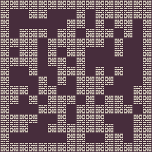
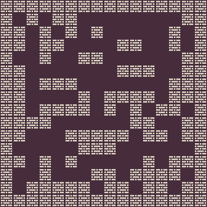
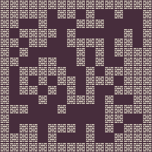

<p align="center">
	
    
    
</p>
<h1 align="center">
Binary Problem
</h1>

The binary problem is from the PCGRL framework where the goal is to generate a 2D maze of empty and solid tile where it is fully connected and have a long path in it that is more than the manhattan distance between coroners of the maze.

The problem has 3 variants:
- `binary-v0`: generate a maze of size 14x14 (excluding borders) with minimum path length of 28 (14+14)
- `binary-wide-v0`: generate a maze of size 28x14 (excluding borders) with minimum path length of 42 (28+14)
- `binary-large-v0`: generate a maze of size 28x28 (excluding borders) with minimum path length of 56 (28+28)

## Content Structure
The content is a 2D binary array of **height x width** where 1 is empty and 0 is solid. Here is an example of a content
```
11111111111111
00000000000111
11111111110111
11100001110111
11101111110111
11100000000111
11111110111111
00001110111111
01111110111011
01111110111000
01101110111111
01100000000111
01111111110111
01111111111111
```

## Control Parameter


## Adding a new Variant
If you want to add new variants for this framework, you can add it to [`__init__.py`](https://github.com/amidos2006/pcg_benchmark/blob/main/pcg_benchmark/probs/binary/__init__.py) file. To add new variant please try to follow the following name structure `binary-{variant}-{version}` where `{version}` if first time make sure it is `v0`. The following parameter can be changed to create the variant:
- `width(int)`: the width of the maze
- `height(int)`: the height of the maze
- `diversity(float)`: the diversity percentage that if passes it it is 1 (optional=0.4) 
- `path(float)`: the target path length percentage this value is multiplied by (width+height) (optional=1.0)

## Quality Measurement


## Diversity Measurement


## Controlability Measurement
