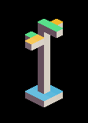

<p align="center">
	
</p>
<h1 align="center">
Building Problem
</h1>

The building problem is inspired by Jiang et al. work ["Learning Controllable 3D Level Generators"](https://arxiv.org/abs/2206.13623). The goal is to create a building in a 3D space using 4 different type of lego blocks (1x1, 1x3, 3x1, 3x3). All the lego block should be able to be used and the minimum height of the building should be more than a percentage of the maximum height of the 3D area.

The problem has 4 variants:
- `building-v0`: generate a 3d building with max size of 7x7x12 using 40 blocks with min percentage height of 50% (6).
- `building-large-v0`: generate a 3d building with max size of 11x11x12 using 180 blocks with min percentage height of 50% (6).
- `building-tall-v0`: generate a 3d building with max size of 7x7x24 using 80 blocks with min percentage height of 50% (12).
- `building-huge-v0`: generate a 3d building with max size of 11x11x24 using 360 blocks with min percentage height of 50% (12).

## Content Structure
The content is an array of objects that represents falling Tetris **blocks**. Each object has `x(int)`, `y(int)`, and `type(int)`. Here is an example using 12 blocks only in the 7x7x12 space
```python
[
    {
        "x": 2, "y": 2, "type": 3
    },
    {
        "x": 3, "y": 3, "type": 0
    },
    {
        "x": 3, "y": 3, "type": 0
    },
    {
        "x": 3, "y": 3, "type": 0
    },
    {
        "x": 3, "y": 3, "type": 0
    },
    {
        "x": 3, "y": 3, "type": 0
    },
    {
        "x": 3, "y": 3, "type": 0
    },
    {
        "x": 3, "y": 3, "type": 0
    },
    {
        "x": 1, "y": 3, "type": 1
    },
    {
        "x": 3, "y": 3, "type": 2
    },
    {
        "x": 3, "y": 1, "type": 2
    },
    {
        "x": 3, "y": 3, "type": 1
    }
]
```
if the `x` or `y` of dropping is bigger or smaller than `width` or `height` then they get adjusted to be in the same sized area. There is 4 types of blocks:
- *0:* 1x1 block
- *1:* 1x3 block
- *2:* 3x1 block
- *3:* 3x3 block

## Control Parameter
The control parameter provides the number of different blocks that can be used to build the building. It is like building a building with limited lego pieces. Here is an example for total of 40 blocks
```python
{
    "1x1": 30,
    "1x3": 4,
    "3x1": 4,
    "3x3": 2
}
```

## Adding a new Variant
If you want to add new variants for this framework, you can add it to [`__init__.py`](https://github.com/amidos2006/pcg_benchmark/blob/main/pcg_benchmark/probs/building/__init__.py) file. To add new variant please try to follow the following name structure `building-{variant}-{version}` where `{version}` if first time make sure it is `v0`. The following parameter can be changed to create the variant:
- `width(int)`: the max width of the building
- `length(int)`: the max length of the building
- `height(int)`: the max height of the building
- `blocks(int)`: the number of blocks that you are able to use to build a building (optional=width*length*height/9)
- `minHeight(float)`: the percentage of the max height that the building lowest part should reach (optional=0.5)
- `diversity(float)`: the diversity percentage that if you pass it, the diversity value is equal to 1 (optional=0.4)

An easier way without editing the framework files is to use the `register` function from the `pcg_benchmark` to add the variant.
```python
from pcg_benchmark.probs.building import BuildingProblem
import pcg_benchmark

pcg_benchmark.register('building-extreme-v0', BuildingProblem, {"width": 24, "length": 24, "height": 10, "blocks": 500})
```

## Quality Measurement
To pass the quality criteria, you need to pass two of criteria
- have a the blocks be abled to be used and not outside of the height
- have a lowest height of the building more than 50% of the max height. For example in `building-v0`, the min height is 6

## Diversity Measurement
To pass the diversity criteria, you need the input levels have at least 40% difference on the hamming distance measuring criteria for each different block type summed.

## Controlability Measurement
To pass the controlability criteria, you need the blocks used in the content to be equal to the control parameter values.

## Content Info
This is all the info that you can get about any content using the `info` function:
- `blocks(int)`: the amount of blocks that were able to be placed in the space
- `heights(int[])`: an integer array of the different height values of the different location on the map
- `lvl_1x1(int[][][])`|`lvl_1x3(int[][][])`|`lvl_3x1(int[][][])`|`lvl_3x3(int[][][])`: a 3D array that showcase each block type in space without the others
- `1x1(int)`|`1x3(int)`|`3x1(int)`|`3x3(int)`: the number of different block types used in the problem