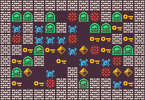

<p align="center">
	
</p>
<h1 align="center">
Dangerous Dave Problem
</h1>

This is a small discrete version of the DOS game [Dangerous Dave](https://www.retrogames.cz/play_480-DOS.php) similar to the one implemented in the [PCGRL Framework](https://github.com/amidos2006/gym-pcgrl). Dangerous dave is a small platformer where you need to get a key avoid spikes and collect diamonds and get to exit. The goal is to create a playable Dangerous Dave level where the player can get reach key, door, and diamonds. Finally, the game solution should have a minimum number of jumps.

The problem has 3 variants:
- `ddave-v0`: generate a 11x7 level (without the borders) where the solution has minimum number of jumps equal to 2.
- `ddave-complex-v0`: generate a 11x7 level (without the borders) where the solution has minim number of jumps equal to 6.
- `ddave-large-v0`: generate a 17x11 level (without the borders) where the solution has minimum number of jumps equal to 10.

## Content Structure
The content is a 2D array **height x width** of int of values between 0 and 6 that represents a Dangerous Dave level. Here is an example of a level
```python
[
    [1,1,6,6,6,1,1,4,1,1,5],
    [1,1,1,1,1,1,1,0,0,0,0],
    [4,4,1,1,1,4,4,1,1,1,1],
    [0,0,1,1,1,0,0,1,1,1,1],
    [1,1,4,4,4,1,1,4,4,4,1],
    [1,1,0,0,0,1,1,0,0,0,1],
    [2,1,1,1,1,1,1,0,3,1,1],
]
```
Different values have different meaning
- *0:* solid tile
- *1:* empty tile
- *2:* player tile
- *3:* exit tile
- *4:* diamond tile
- *5:* key tile
- *6:* spike tile
The system finds the biggest fully connected area from a player starting location and use that as the main area and transform all the other non reachable area into solid tiles.

## Control Parameter
The control parameter provides the player starting location (`sx` and `sy`), exit location (`ex` and `ey`), and finally number of diamonds that should appear in the level (`diamonds`). Here is an example of the control parameter.
```python
{
    "sx": 0,
    "sy": 6,
    "ex": 3,
    "ey": 0,
    "diamonds": 4
}
```

## Adding a new Variant
If you want to add new variants for this framework, you can add it to [`__init__.py`](https://github.com/amidos2006/pcg_benchmark/blob/main/pcg_benchmark/probs/ddave/__init__.py) file. To add new variant please try to follow the following name structure `ddave-{variant}-{version}` where `{version}` if first time make sure it is `v0`. The following parameter can be changed to create the variant:
- `width(int)`: the width of the level
- `height(int)`: the height of the level
- `jumps(int)`: the minimum number of jumps that has to be in the solution
- `solver(int)`: the solver power for checking level solvability, the higher the better but also the slower (optional=5000)
- `diversity(float)`: the diversity percentage that if you pass it, the diversity value is equal to 1 (optional=0.4)

An easier way without editing the framework files is to use the `register` function from the `pcg_benchmark` to add the variant.
```python
from pcg_benchmark.probs.ddave import DangerDaveProblem
import pcg_benchmark

pcg_benchmark.register('ddave-extreme-v0', DangerDaveProblem, {"width": 22, "height": 14, "jumps": 20})
```

## Quality Measurement
To pass the quality criteria, you need to pass multiple of criteria
- have one player, one key, and one door, has minimum number of diamonds (min(width,height)) and spikes (2*max(width,height))
- The player and the exit should be above a solid tile
- the level has to be playable and the level solution has to have the minimum number of jumps
- Finally, all the diamonds need to be reachable

## Diversity Measurement
To pass the diversity criteria, you need the solution heatmap between the two levels have at least 40% difference on the hamming distance measuring criteria.

## Controlability Measurement
To pass the controlability criteria, you need the starting and ending location of the player at certain locations and the number of reachable diamonds equal to the control parameter values.

## Content Info
This is all the info that you can get about any content using the `info` function:
- `players(int)`: number of player tiles in the map 
- `exits(int)`: number of exit tiles in the map 
- `diamonds(int)`: number of diamond tiles in the map
- `keys(int)`: number of key tiles in the map
- `player_locations((int,int)[])`: a tuple array of the all the x,y locations of all the player tiles on the map
- `exit_locations((int,int)[])`: a tuple array of the all the x,y locations of all the exit tiles on the map
- `diamond_reachable(float[])`: an array of values where each value tells you how close the player is to collect a specific diamond (0 means they have collected that diamond), 
- `heuristic(float)`: a value that tells you how close the player to winning (0 if the player won the game), 
- `solution(dict[str,int][])`: an array of the actions needed to solve the level if this is possible
- `repaired_content((int)[][])`: this is the level after it got cleaned of any isolated areas