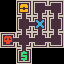

<p align="center">
	
</p>
<h1 align="center">
The Binding of Isaac Problem
</h1>

The goal is to generate a simplistic version of the original dungeon of ["The Binding of Isaac"](https://store.steampowered.com/app/113200/The_Binding_of_Isaac/) by [Edmund Mcmillen](https://x.com/edmundmcmillen). The goal is to make sure that you have a fully connected dungeon that contains a minimum number of rooms and have starting room, boss room, treasure room, and shop room.

The problem has 3 variants:
- `isaac-v0`: generate a dungeon of size 4x4 with maximum number of rooms equal to 6
- `isaac-medium-v0`: generate a dungeon of size 6x6 with maximum number of rooms equal to 12
- `isaac-large-v0`: generate a dungeon of size 8x8 with maximum number of rooms equal to 24

## Content Structure
The content is json object of multiple values that represent the dungeon layout (`layout`), the starting room (`start`), the boss room (`boss`), and the treasure room (`treasure`). Here is an example of the content:
```python
{
    "layout": [0, 8, 12, 9, 0, 14, 11, 10, 4, 15, 7, 3, 0, 2, 0, 0],
    "start": 6,
    "boss": 8,
    "shop": 13,
    "treasure": 1,
}
```
To explain more about the content here are the main attributes:
- `layout(int[])`: is a 1D array of length equal to the full size of the map (`width`x`height`) where it is a flatten array of that map. If the value is `0` it means that there is no room, otherwise it can have a value between 1 to 15 which represents the connections to the surrounding rooms as the following:
    - *1:* 
    - *2:* 
    - *3:* 
    - *4:* 
    - *5:* 
    - *6:* 
    - *7:* 
    - *8:* 
    - *9:* 
    - *10:* 
    - *11:* 
    - *12:* 
    - *13:* 
    - *14:* 
    - *15:* 
- `start(int)`|`boss(int)`|`shop(int)`|`treasure(int)`: is an index between 0 and map area (`width`x`height`) that represent the index of which room in the 1D layout array.

## Control Parameter

```python
{
    "map_size": 40
}
```

## Adding a new Variant
If you want to add new variants for this framework, you can add it to [`__init__.py`](https://github.com/amidos2006/pcg_benchmark/blob/main/pcg_benchmark/probs/isaac/__init__.py) file. To add new variant please try to follow the following name structure `isaac-{variant}-{version}` where `{version}` if first time make sure it is `v0`. The following parameter can be changed to create the variant:
- `width(int)`: the width of the dungeon layout
- `height(int)`: the height of the dungeon layout
- `map_size(int)`: the minimum number of rooms the dungeon should have (optional=6)
- `diversity(float)`: the diversity percentage that if you pass it, the diversity value is equal to 1 (optional=0.6)

## Quality Measurement
To pass the quality criteria, you need to pass multiple of criteria
- The rooms need to be close to each other where there is no isolate rooms far away from the others
- The connections should create a fully connected dungeon
- All the special rooms `start`, `boss`, `shop`, and `treasure` need to exist in a different unique room in the dungeon.
- No more loose connections which means all connections have to lead to a room and not to an empty area.

## Diversity Measurement
To pass the diversity criteria, you need to have a dungeon layout different from each other either based on number of rooms or connection or both.

## Controlability Measurement
To pass the controlability criteria, you need to make sure that the number of rooms is equal to the control parameter `map_size`.