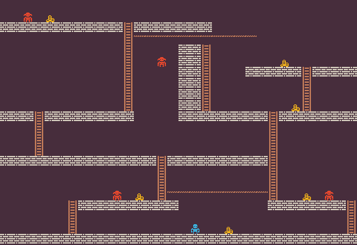

<p align="center">
	
</p>
<h1 align="center">
Lode Runner Problem
</h1>

This is a simple version of the classic game [Lode Runner](https://loderunnerwebgame.com/game/). Lode Runner is an arcade puzzle platformer where the player can't jump and they need to collect all the gold without being caught by the enemies. The player can move horizontal and climb ladders and dig through the floor. In this version, digging was discarded infavor for evaluation speed. The goal of this problem is to generate a playable lode runner level that have aesthetic similarity to the original levels of lode runner.

The problem has 3 variants:
- `loderunner-v0`: generate a full lode runner level of size 32x21 tiles where it has at least 6 golds and 3 enemies
- `loderunner-gold-v0`: generate a full lode runner level of size 32x21 tiles where it has at least 18 golds and 3 enemies
- `loderunner-enemies-v0`: generate a full lode runner level of size 32x21 tiles where it has at least 6 golds and 12 enemies

## Content Structure
The content is just a 2D array of 21 rows by 32 columns where each cell have a value that represent a game tile. Here is an example of content:
```python
[
    [1,1,1,1,1,1,1,1,1,1,1,1,1,1,1,1,1,1,1,1,1,1,1,1,1,1,1,1,1,1,1,1],
    [1,1,4,1,3,1,1,1,1,1,1,1,1,1,1,1,1,1,1,1,1,1,1,1,1,1,1,1,1,1,1,1],
    [0,0,0,0,0,0,0,0,0,0,0,5,0,0,0,0,0,0,0,1,1,1,1,1,1,1,1,1,1,1,1,1],
    [1,1,1,1,1,1,1,1,1,1,1,5,6,6,6,6,6,6,6,6,6,6,6,1,1,1,1,1,1,1,1,1],
    [1,1,1,1,1,1,1,1,1,1,1,5,1,1,1,1,0,0,5,1,1,1,1,1,1,1,1,1,1,1,1,1],
    [1,1,1,1,1,1,1,1,1,1,1,5,1,1,4,1,0,0,5,1,1,1,1,1,1,3,1,1,1,1,1,1],
    [1,1,1,1,1,1,1,1,1,1,1,5,1,1,1,1,0,0,5,1,1,1,0,0,0,0,0,5,0,0,0,0],
    [1,1,1,1,1,1,1,1,1,1,1,5,1,1,1,1,0,0,5,1,1,1,1,1,1,1,1,5,1,1,1,1],
    [1,1,1,1,1,1,1,1,1,1,1,5,1,1,1,1,0,0,5,1,1,1,1,1,1,1,1,5,1,1,1,1],
    [1,1,1,1,1,1,1,1,1,1,1,5,1,1,1,1,0,0,5,1,1,1,1,1,1,1,3,5,1,1,1,1],
    [0,0,0,5,0,0,0,0,0,0,0,0,1,1,1,1,0,0,0,0,0,0,0,0,5,0,0,0,0,0,0,0],
    [1,1,1,5,1,1,1,1,1,1,1,1,1,1,1,1,1,1,1,1,1,1,1,1,5,1,1,1,1,1,1,1],
    [1,1,1,5,1,1,1,1,1,1,1,1,1,1,1,1,1,1,1,1,1,1,1,1,5,1,1,1,1,1,1,1],
    [1,1,1,5,1,1,1,1,1,1,1,1,1,1,1,1,1,1,1,1,1,1,1,1,5,1,1,1,1,1,1,1],
    [0,0,0,0,0,0,0,0,0,0,0,0,0,0,5,0,0,0,0,0,0,0,0,0,5,1,1,1,1,1,1,1],
    [1,1,1,1,1,1,1,1,1,1,1,1,1,1,5,1,1,1,1,1,1,1,1,1,5,1,1,1,1,1,1,1],
    [1,1,1,1,1,1,1,1,1,1,1,1,1,1,5,1,1,1,1,1,1,1,1,1,5,1,1,1,1,1,1,1],
    [1,1,1,1,1,1,1,1,1,1,4,1,3,1,5,6,6,6,6,6,6,6,6,6,5,1,1,3,1,4,1,1],
    [1,1,1,1,1,1,5,0,0,0,0,0,0,0,0,0,1,1,1,1,1,1,1,1,0,0,0,0,0,0,0,5],
    [1,1,1,1,1,1,5,1,1,1,1,1,1,1,1,1,1,1,1,1,1,1,1,1,1,1,1,1,1,1,1,5],
    [1,1,1,1,1,1,5,1,1,1,1,1,1,1,1,1,1,2,1,1,3,1,1,1,1,1,1,1,1,1,1,5]
]
```
The values represent different game tiles, these values are as the follow:
- *0:* solid tile
- *1:* empty tile
- *2:* player tile
- *3:* gold tile
- *4:* enemy tile
- *5:* ladder tile
- *6:* rope tile
The system add the bottom layer of floor for walking so no need to have it in the content.

## Control Parameter
The control parameter is a simple, it is two values that determine how many ladders or ropes are presented in the level. To pass the criteria, you need to make sure that the level have around the provided values for ladder and ropes. The control values can have values from 0 to 20% the area of the level (134). Here is an example of a control parameter:
```python
{
    "ladder": 20,
    "rope": 30
}
```

## Adding a new Variant
If you want to add new variants for this framework, you can add it to [`__init__.py`](https://github.com/amidos2006/pcg_benchmark/blob/main/pcg_benchmark/probs/loderunner/__init__.py) file. To add new variant please try to follow the following name structure `loderunner-{variant}-{version}` where `{version}` if first time make sure it is `v0`. The following parameter can be changed to create the variant:
- `width(int)`: the width of the level layout
- `height(int)`: the height of the level layout
- `gold(int)`: the minimum number of gold that should exists in the level
- `enemies(int)`: the minimum number of enemies that should exists in the level
- `exploration(float)`: the percentage of the level that is reachable by walking in the level (optional=0.2)
- `diversity(float)`: the diversity percentage that if you pass it, the diversity value is equal to 1 (optional=0.6)

An easier way without editing the framework files is to use the `register` function from the `pcg_benchmark` to add the variant.
```python
from pcg_benchmark.probs.loderunnertile import LodeRunnerProblem
import pcg_benchmark

pcg_benchmark.register('loderunnertile-extreme-v0', LodeRunnerProblem, {"width": 32, "height": 21, "gold": 40, "enemies": 20})
```

## Quality Measurement
To pass the quality criteria, you need to pass multiple of criteria
- There has to be one player
- There has to be minimum number of gold equal to the problem value (`gold`)
- There has to be a minimum number of enemies equal to the problem value (`enemies`)
- The player should be able to explore at least a specific amount of the level specified by the problem which is 20%
- The player is able to collect all the gold from the starting location
- The player is able to reach 75% of the tile surfaces that can be used. This means if there is a thick floor of bricks only the top bricks need the player to be able to move on them
- The horizontal and vertical groups of ladder, ropes, and bricks should fall in the same distribution like the original lode runner. This metric is added to make sure the system produce a nice looking levels and not noisy looking ones.

## Diversity Measurement
To pass the diversity criteria, the hamming distance between the different player paths to explore the whole map should be different.

## Controlability Measurement
To pass the controlability criteria, you need to make sure that the number of ladders and ropes is close to the controlability provided parameters.

## Content Info
This is all the info that you can get about any content using the `info` function:
- `player`: number of player tiles
- `gold`: number of gold tiles
- `enemy`: number of enemy tiles
- `ladder`: number of ladder tiles
- `rope`: number of rope tiles
- `empty`: number of empty tiles
- `islands`: number of bricks, ropes, and ladders when they are combined together
- `exploration`: a 2D map of all the visited tiles in the map and the state of the player during visiting this tile
    - *0:* is never visited
    - *1:* the player is standing on brick tile
    - *2:* the player is climbing a ladder
    - *3:* the player is hanging from a rope
    - *4:* the player is falling
- `collected_gold`: number of collected golds
- `used_tiles`: number of none empty tiles that the player is able to visit
- `tiles`: number of none empty tiles that is accessible (if brick tile it needs to have empty tile above it)
- `walking`: the Jensen Shannon distance between the player walkable areas of original lode runner levels and current level
- `hanging`: the Jensen Shannon distance between the player hanging from rope area of original lode runner levels and current level
- `climbing`: the Jensen Shannon distance between the player climbing a ladder area of original lode runner levels and current level
- `falling`: the Jensen Shannon distance between the player falling areas of original lode runner levels and current level