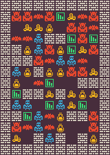

	

<h1 align="center">
MiniDungeon Problem
</h1>

The problem has 3 variants:
- `mdungeons-v0`
- `mdungeons-enemies-v0`
- `mdungeons-mdungeon-v0`

## Content Structure

## Control Parameter

## Adding a new Variant

## Quality Measurement

## Diversity Measurement

## Controlability Measurement
