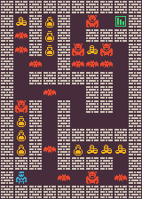

<p align="center">
	
</p>
<h1 align="center">
MiniDungeons Problem
</h1>

This problem is based on the Mini Dungeons problem introduced by Liapis et al. in ["Procedural personas as critics for dungeon generation"](https://citeseerx.ist.psu.edu/document?repid=rep1&type=pdf&doi=50c9a06c669a60491101b2e10e3887dd28c3d3f3). The game is pretty simple, the player need to reach the exit without dying. The goal of the problem is to generate a level that is fully connected and forces the player to kill enemies before reaching the exit.

The problem has 3 variants:
- `mdungeons-v0`: generate a solvable 8x12 (without the borders) mini dungeon level with 8 enemies in it
- `mdungeons-enemies-v0`: generate a solvable 8x12 (without the borders) mini dungeon level with 16 enemies
- `mdungeons-large-v0`: generate a solvable 16x24 (without the borders) mini dungeon level with 16 enemies

## Content Structure
The content is just a 2D array of the dungeon based on the width and height provided where each cell have a value that represent a game tile. Here is an example of content for an 8x12 level:
```python
[
	[5, 0, 4, 0, 1, 7, 1, 3],
	[6, 0, 4, 0, 1, 0, 0, 0],
	[6, 0, 4, 0, 7, 5, 7, 1],
	[1, 6, 1, 0, 6, 6, 6, 1],
	[1, 0, 0, 0, 0, 0, 0, 1],
	[1, 1, 6, 1, 1, 0, 0, 1],
	[7, 0, 1, 0, 1, 0, 0, 1],
	[4, 0, 1, 0, 1, 1, 1, 1],
	[4, 0, 1, 0, 0, 0, 0, 0],
	[4, 0, 6, 0, 4, 5, 5, 5],
	[0, 0, 1, 0, 0, 0, 0, 1],
	[2, 1, 1, 6, 1, 7, 1, 6],
]
```
The values in the array has the following meaning:
- *0:* solid tile
- *1:* empty tile
- *2:* player tile
- *3:* exit tile
- *4:* potion tile (heals for 2)
- *5:* treasure tile
- *6:* goblin enemy tile (does 1 damage)
- *7:* ogre enemy tile (does 2 damage)

## Control Parameter
The control parameter is simple, it is two values that determine how many treasures the player need to collect in their path and the solution length of the level. To pass the criteria, you need to make sure that the level solution is passed in the required length and the player collect the amount of treasures specified. Here is an example of the control parameters:
```python
{
	"col_treasure": 5,
	"solution_length": 28
}
```

## Adding a new Variant
If you want to add new variants for this framework, you can add it to [`__init__.py`](https://github.com/amidos2006/pcg_benchmark/blob/main/pcg_benchmark/probs/mdungeons/__init__.py) file. To add new variant please try to follow the following name structure `mdungeons-{variant}-{version}` where `{version}` if first time make sure it is `v0`. The following parameter can be changed to create the variant:
- `width(int)`: the width of the level
- `height(int)`: the height of the level
- `enemies(int)`: the minimum number of enemies that the shortest solution must kill before winning
- `solver(int)`: the maximum number of node expansions for the solver before it decides there is no solution. The higher the value the solver will be able to solve more complex levels (optional=5000)
- `diversity(float)`: the diversity percentage that if you pass it, the diversity value is equal to 1 (optional=0.4)

An easier way without editing the framework files is to use the `register` function from the `pcg_benchmark` to add the variant.
```python
from pcg_benchmark.probs.mdungeons import MiniDungeonProblem
import pcg_benchmark

pcg_benchmark.register('mdungeons-extreme-v0', MiniDungeonProblem, {"width": 24, "height": 36, "enemies": 40, "solver": 100000})
```

## Quality Measurement
To pass the quality criteria, you need to pass multiple of criteria
- The level has to be fully connected
- There has to be one player and one exit
- The amount of enemies killed on the shortest solution for the level should be more than `enemies` parameter for the problem
- The level has at least 50% solid and empty tiles
<!-- - The distance between enemies and treasure and potions maximized so nothing is clustered around the player starting location. -->

## Diversity Measurement
To pass the diversity criteria, the distance between the solution of two individuals and the hamming distance between the flattened maps should be different.

## Controlability Measurement
To pass the controlability criteria, you need to make sure that the number of collected treasures and the solution length is close to the controlability provided parameters.

## Content Info
This is all the info that you can get about any content using the `info` function:
- `regions(int)`: number of fully connected regions in the dungeon
- `players(int)`: number of players in the dungeon
- `exits(int)`: number of exits in the dungeon
- `potions(int)`: number of potions in the dungeon
- `treasures(int)`: number of treasures in the dungeon
- `enemies(int)`: number of enemies in the dungeon
- `heuristic(float)`: heuristic value for how close the player to beat the level, the lower the better (0 means the level is beatable)
- `solution(dict(str,int)[])`: an array of all the actions that the player need to take to win the level
- `solution_length(int)`: the number of steps that are needed to win the level
- `content(int[][])`: a 2D array of the current content
- `status(str)`: the status of the current game, it can have one of the following values
	- *running:* the game is still running and neither the player lost nor win
	- *win:* the game ended because the player won
	- *lose:* the game ended because the player lost
- `health(int)`: the remaining health of the player after playing the game
- `col_treasures(int)`: the number of collected treasures by the player
- `col_potions(int)`: the number of collected potions by the player
- `col_enemies(int)`: the number of killed enemies by the player