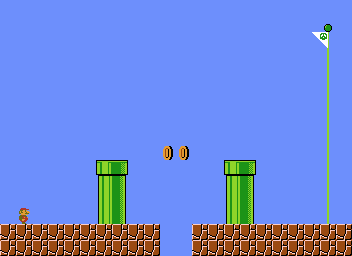

<p align="center">
	
</p>
<h1 align="center">
Super Mario Bros Problem
</h1>

This problem is inspired by the work Dahlskog and Togelius in ["Linear levels through n-grams"](http://julian.togelius.com/Dahlskog2014Linear.pdf) where the mario level is represented as a sequence of vertical slices that are sampled from the original super mario bros. The problem is to generate a fully playable mario level that looks similar to the original mario level (no broken tubes and doesn't look noisey).

The problem has 3 variants:
- `smb-v0`: generate a super mario bros level of 150 slices (without the start or the flag) which is similar to the original levels
- `smb-medium-v0`: generate a shorter super mario bros level of 100 slices (without the start or the flag)
- `smb-small-v0`: generate a shorter super mario bros level of 50 slices (without the start or the flag)
- `smb-scene-v0`: generate a scene for super mario bros level that encompass usually a single mechanic similar to the scenes generated by ["Evolving Mario Levels in the Latent Space of a Deep Convolutional Generative Adversarial Network"](https://arxiv.org/abs/1805.00728) or by ["Intentional Computation Level Design"](https://arxiv.org/abs/1904.08972). The scene is 16 slices long (without the start or the flag).

## Content Structure
The content is a integer array of the int values that represent which slice out of the [`slices.txt`](https://github.com/amidos2006/pcg_benchmark/blob/main/pcg_benchmark/probs/smb/slices.txt). The value is between 0 and 126 as there is 127 slices total. Here is an example of a scene (16 slices):

```python
[ 0, 0, 0, 8, 8, 0, 0, 26, 26, 0, 0, 8, 8, 0, 0, 0 ]
```

To under the slices, each row is a vertical slice of 16 values. The values are as follow:
- *-:* empty tile
- *X:* solid floor tile
- *#:* solid ladder tile
- *S:* breakable brick tile (can be destroyed when bump in it from under and mario is not in small form)
- *Q:* question mark block tile (contains a special surprise when bump in it from under)
- *t:* tube tile
- *o:* coin object (collectible coin)
- *g:* gomba enemy (they die from one jump)
- *k:* koopa enemy (they leave a shell when jump on them)
- *y:* spiny enemy (can't jump on them to kill)

## Control Parameter
The control parameter is simple, it is about controling the playthrough during the level. There is three control parameters `enemies`, `jumps`, and `coins` where each correspond to how many of these items should be achieved during a playtrace. Here is an example of control parameter for normal (150 slice level):

```python
{
	"enemies": 5,
	"jumps": 15
	"coins": 8
}
```

## Adding a new Variant
If you want to add new variants for this framework, you can add it to [`__init__.py`](https://github.com/amidos2006/pcg_benchmark/blob/main/pcg_benchmark/probs/smb/__init__.py) file. To add new variant please try to follow the following name structure `smb-{variant}-{version}` where `{version}` if first time make sure it is `v0`. The following parameter can be changed to create the variant:
- `width(int)`: the width of the level
- `empty(float)`: percentage of the level that is empty (optional=0.5)
- `fenemies(float)`: percentage of enemies that are not on the ground (optional=0.1)
- `timer(int)`: the amount of time that the level should be finished in (optional=width/10)
- `solver(int)`: the maximum number of node expansions for the solver before it decides to execute its plan (optional=100/(width<30+1))
- `diversity(float)`: the diversity percentage that if you pass it, the diversity value is equal to 1 (optional=0.4)

An easier way without editing the framework files is to use the `register` function from the `pcg_benchmark` to add the variant.
```python
from pcg_benchmark.probs.smb import MarioProblem
import pcg_benchmark

pcg_benchmark.register('smb-extreme-v0', MarioProblem, {"width": 16, "empty": 0.25, "fenemies": 0.5})
```

## Quality Measurement
To pass the quality criteria, you need to pass multiple of criteria
- The level has to have minimal horizontal changes
- The level has to have unbroken pipes (as pipes spawn on two slices)
- The level has 50% or more of just flat platform to comply with mario distribution of tiles
- The level shouldn't contain very few floating enemies (most enemies should be on a solid tile)
- The level has to be beatable by the A* agent

## Diversity Measurement
To pass the diversity criteria, the distance between the locations that each player visit in both maps. If the player can't move at all, the maps are considered not different.

## Controlability Measurement
To pass the controlability criteria, you need to make sure that the number of jumps, collected coins, and killed enemies is close to the controlability provided parameters.

## Content Info
This is all the info that you can get about any content using the `info` function:
- `width(int)`: the level length
- `tube(int)`: number of issues with mario tubes (a tube should be 2 slices wide)
- `noise(float)`: percentage of changes horizontally from one tile to the next for each row
- `complete(float)`: percentage of the level beaten by A* agent
- `enemies(int)`: number of enemies that the A* player killed in total and not by falling off the map
- `coins(int)`: number of collected coins by the A* player
- `jumps(int)`: number of jumps executed by the A* player
- `actions(int[])`: list of all the actions executed by the A* player
- `locations([float, float][])`: an array of all the [x, y] locations that the A* player visit