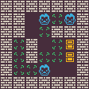

<p align="center">
	
</p>
<h1 align="center">
Sokoban Problem
</h1>

[Sokoban](https://www.sokobanonline.com/) is an old Japanese block pushing game that inspired a lot of games ([Baba is You](https://store.steampowered.com/app/736260/Baba_Is_You/)) and game engines ([PuzzleScript](https://www.puzzlescript.net/)). The goal of the problem is to generate a solvable interesting puzzles for the sokoban game. This problem comes from the [PCGRL framework](https://github.com/amidos2006/gym-pcgrl) which means you could use your RL generator to solve the problem.

The problem has 3 variants:
- `sokoban-v0`: create a 5x5 level (without the borders) with at least 1 crate and require at least 10 moves to solve.
- `sokoban-complex-v0`: create a 5x5 level (without the borders) with at least 1 crate and requires at least 40 moves to solve.
- `sokoban-large-v0`: create an 8x8 level (without the borders) with at least 1 crate and requires at least 48 moves to solve.

## Content Structure
The content representation is a 2D integer array where numbers represent different game tiles. Here is an example of 5x5 level from the microban set by David W Skinner:
```python
[
	[0, 1, 4, 0, 0],
	[0, 1, 1, 0, 0],
	[0, 4, 3, 2, 1],
	[0, 1, 1, 3, 1],
	[0, 1, 1, 0, 0],
]
```
The different integers have different meaning, here is an explanation for all of them:
- *0:* solid tile
- *1:* empty tile
- *2:* player tile
- *3:* block tile
- *4:* target tile

## Control Parameter
The control parameter is pretty simple, it is mainly about how many crates are needed to be inside the level. Here an example of a control parameter sample:
```python
{
	"crates": 4
}
```

## Adding a new Variant
If you want to add new variants for this framework, you can add it to [`__init__.py`](https://github.com/amidos2006/pcg_benchmark/blob/main/pcg_benchmark/probs/sokoban/__init__.py) file. To add new variant please try to follow the following name structure `sokoban-{variant}-{version}` where `{version}` if first time make sure it is `v0`. The following parameter can be changed to create the variant:
- `width(int)`: the width of the level
- `height(int)`: the height of the level
- `difficulty(float)`: the difficulty of the solution. Difficulty is transformed to minimum number of steps using the following formula (width + height) * difficulty
- `solver(int)`: the solver number of nodes to expand before deaming the level is unsolvable (optional=5000)
- `diversity(float)`: the diversity percentage that if you pass it, the diversity value is equal to 1 (optional=0.5)

An easier way without editing the framework files is to use the `register` function from the `pcg_benchmark` to add the variant.
```python
from pcg_benchmark.probs.sokoban import SokobanProblem
import pcg_benchmark

pcg_benchmark.register('sokoban-extreme-v0', SokobanProblem, {"width": 10, "height": 10, "difficulty": 5, "solver": 200000})
```

## Quality Measurement
To pass the quality criteria, you need to pass multiple of criteria
- The level has to have 1 player
- The level has to have at least 1 crates
- The difference between crates and target locations is 0
- The level is solvable by the A* agent
- The solution length is at least of length equal to (width + height) * difficulty

## Diversity Measurement
To pass the diversity criteria, the distance between the compressed solution string for both level is at least 50% different. The compressed solution string was taken from the work of Zakaria et al. in ["Procedural Level Generation for Sokoban via Deep Learning: An Experimental Study"](https://ieeexplore.ieee.org/document/9779063).

## Controlability Measurement
To pass the controlability criteria, you need to make sure that the number of crates is close to the controlability provided parameters.

## Content Info
This is all the info that you can get about any content using the `info` function:
- `players(int)`: number of player tiles in the level.
- `crates(int)`: number of crate tiles in the level.
- `targets(int)`: number of target tiles in the level.
- `content(int[][])`: the content that was being evaluated
- `heuristic(float)`: how close the level towards playability (0 when the level is playable).
- `solution(dict[str,int][])`: an array of all the actions taken during the game in form "x" and "y".
