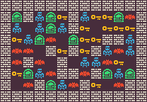

<p align="center">
	
</p>
<h1 align="center">
Zelda Problem
</h1>

The zelda problem was introduced originally throught the [GVGAI framework](https://github.com/EssexUniversityMCTS/gvgai). The problem is a bit more complicated than generating a maze as there has to be connectivity and specific number of items on the map which made it get a lot of research attraction and used in many papers (["Path of Destruction"](https://arxiv.org/abs/2202.10184), ["PCGRL: Procedural Content Generation via Reinforcement Learning"](https://arxiv.org/abs/2001.09212), ["Bootstrapping conditional gans for video game level generation"](https://arxiv.org/abs/1910.01603)). The problem is just a simple dungeon crawler where the player need to get a key and go to the door without dying from the enemies. The goal of the problem is to generate a fully connected playable level with enemies.

The problem has 3 variants:
- `zelda-v0`: generate a 11x7 level (excluding borders) with 3 enemies and minimum 18 solution length
- `zelda-enemies-v0`: generate a 11x7 level (excluding borders) with 12 enemies and minimum 18 solution length
- `zelda-large-v0`: generate a 18x12 level (excluding borders with 8 enemies and minimum 30 solution length)

## Content Structure
The content is a 2D integer array representing the level with integers representing the different type of tiles. Here is an example of a level:
```python
[	
	[2,1,1,1,1,1,1,1,0,1,1],
	[1,1,0,1,1,1,1,1,1,1,1],
	[1,1,1,0,1,1,1,0,1,3,0],
	[0,0,1,0,5,1,1,0,0,0,0],
	[1,1,1,1,1,1,1,0,1,4,1],
	[1,5,1,1,1,1,1,1,1,1,1],
	[1,1,1,1,1,5,1,1,1,1,1]
]
```
The tile values have the following meaning:
- *0:* a wall solid tile
- *1:* an empty tile
- *2:* the player tile
- *3:* the key tile
- *4:* the exit door tile
- *5:* enemies tiles

## Control Parameter
The control parameter is about the solution length but controlling how much the player need to reach the key and then how much the player need to reach the door from the key location. Here is an example of sample from the control parameter:
```python
{
    "player_key": 14,
	"key_door": 11
}
```

## Adding a new Variant
If you want to add new variants for this framework, you can add it to [`__init__.py`](https://github.com/amidos2006/pcg_benchmark/blob/main/pcg_benchmark/probs/zelda/__init__.py) file. To add new variant please try to follow the following name structure `zelda-{variant}-{version}` where `{version}` if first time make sure it is `v0`. The following parameter can be changed to create the variant:
- `width(int)`: the width of the level
- `height(int)`: the height of the level
- `enemies(int)`: the minimum number of enemies that should be in the level
- `sol_length(int)`: the minimum length for the solution length so it is not a trivial level (optional=width+height)
- `diversity(float)`: the diversity percentage that if you pass it, the diversity value is equal to 1 (optional=0.3)

An easier way without editing the framework files is to use the `register` function from the `pcg_benchmark` to add the variant.
```python
from pcg_benchmark.probs.zelda import ZeldaProblem
import pcg_benchmark

pcg_benchmark.register('zelda-extreme-v0', ZeldaProblem, {"width": 40, "height": 40, "enemies": 50})
```

## Quality Measurement
To pass the quality criteria, you need to pass multiple of criteria
- The level should be fully connected
- There has to be 1 player
- There has to be 1 key
- There has to be 1 door
- There has to be number of enemies close to the target problem value
- The solution length should not be less than a specific amount defined by the problem

## Diversity Measurement
To pass the diversity criteria, the solution path should be different between different levels using string comparison.

## Controlability Measurement
To pass the controlability criteria, you need to make sure that the distance from player to key and the distance from the key to the door is as close as possible to the controlability provided parameters.

## Content Info
This is all the info that you can get about any content using the `info` function:
- `regions(int)`: number of connected regions
- `players(int)`: number of players in the level
- `keys(int)`: number of keys in the level
- `doors(int)`: number of exit doors in the level
- `enemies(int)`: number of enemies in the level
- `player_key(int)`: the distance between the player and key
- `key_door(int)`: the distance between the key and the door
- `pk_path((int,int)[])`: the path between the player and key as tuples of x, y
- `kd_path((int,int)[])`: the path between the key and the door as tuples of x, y